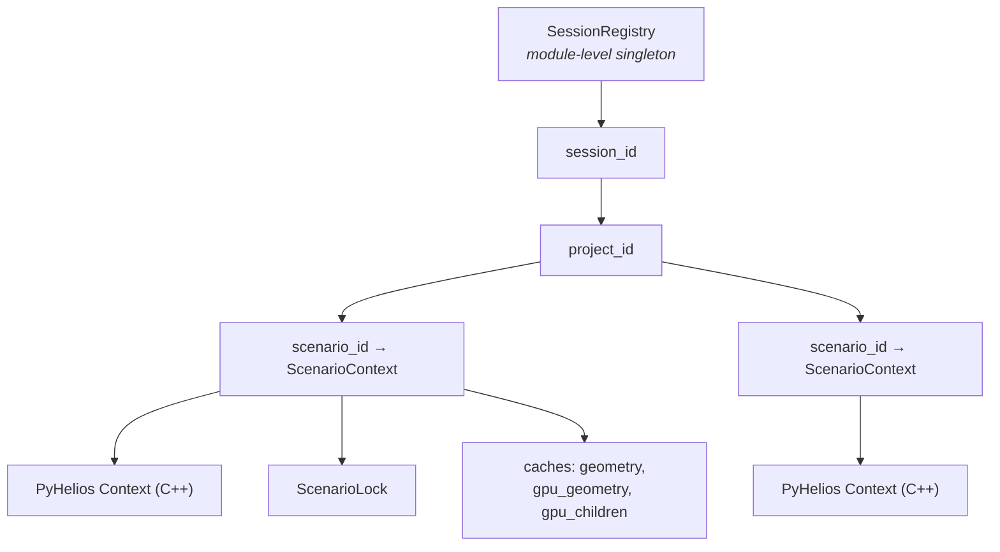

# The Helios context

The **Context** is a PyHelios C++ object that holds the entire 3D world for one scenario. It is
the single most important object in the system and the reason the architecture looks the way it
does.

Three properties drive everything else:

1. **It lives in the backend process only.** It is never copied, serialised into a response, or
   sent to the renderer. Routes mutate it in place.
2. **It is large.** A 1000×1000 ground measures ~1.7 GB resident. A 700×700 scenario holds
   490,000 primitive UUIDs.
3. **It is slow to build.** Rebuilding a saved scene takes seconds to minutes, which is why
   scenario `init` streams progress rather than blocking silently.

## Where it is held

`SessionRegistry` in `app/core/session_store.py` is the **only** place that holds references to
live contexts. Everything goes through it.

`ScenarioContext` (`app/core/scenario_context.py`) uses `__slots__` — a fixed structure, so a typo
raises `AttributeError` immediately rather than silently creating an attribute.

!!! note "Two parallel layers"
    `SessionRegistry` maintains **both** `_store` (session → project → `ProjectContext`, the
    legacy per-project layer) and `_scenarios` (session → project → scenario → `ScenarioContext`).
    They are independent; removing a project wipes both. New work belongs on the scenario layer.

## Locking: many readers, one mutator

Each `ScenarioContext` owns its own `ScenarioLock` — a re-entrant readers/writer lock.

| Operation | Lock | Why |
|---|---|---|
| `writeXML` (autosave) | `read()` | Serialises the context; does not mutate it |
| `pack_primitives` (viewport fetch) | `read()` | Walks primitive data; does not mutate it |
| Geometry create/update/delete | `write()` | Mutates |
| Weather load/clear/delete | `write()` | Mutates `sctx.context` directly |

Two details that were learned the hard way and are worth preserving:

**The lock belongs to the scenario, not the registry.** It used to live on the `SessionRegistry`
singleton, so every scenario in every project queued behind every other. Closing a 700×700 project
made opening a 4×4 one take 7.34 seconds — none of it work, all of it waiting on a save for a
project the user had already closed. PyHelios releases the GIL and holds no global lock, so two
separate contexts genuinely write XML in parallel (7.6s of work in 4.0s wall). The serialisation
was self-inflicted.

**A waiting mutation blocks new readers.** Viewport polling is continuous; without that rule an
edit could wait behind an unbroken run of reads forever.

Mutations that take the lock via the ids rather than the object use the
`@with_context_write_lock` decorator, which locates the `ScenarioContext` from either a
`ScenarioContext` argument or a `(session_id, project_id, scenario_id)` triple. It **raises** if
it can find neither — a mutation that cannot identify its scenario must not run at all rather than
run unguarded.

## Memory: freeing is not returning

Dropping a `ScenarioContext` frees the C++ context, but on glibc the pages stay in the allocator's
arena and RSS does not move. Measured on a 1000×1000 ground:

| Point | Resident |
|---|---|
| Context built | 1742.7 MB |
| After `del ctx` + `gc.collect()` | 1804.6 MB — **nothing given back** |
| After `malloc_trim(0)` | 65.9 MB |

So opening project A, discarding it, then opening B cost `A + B` resident rather than
`max(A, B)` — and the kernel `SIGKILL`ed the server on the second project.

`release_memory()` in `app/helios/context.py` calls `malloc_trim(0)` on a release path. Notes:

- glibc only. It is a no-op on macOS and musl, and there is no Windows equivalent.
- Safe with other scenarios open — it releases free pages and cannot touch a live allocation.
- Costs 62 ms on a 1.7 GB heap, 5 ms on a small one.
- **Must** come after the last reference is gone; a local still holding the `sctx` reclaims
  nothing.

## Availability

PyHelios is imported once at module load, with a fallback chain, and the result is recorded in
`PYHELIOS_AVAILABLE`. When it is false, geometry endpoints return **503** rather than crashing.

There is also a staleness check: at import, the backend compares the native library's mtime
against the newest `.cpp`/`.hpp`/`.h` under `pyhelios/helios-core` and `pyhelios/native`. If the
sources are newer it **rebuilds automatically** (up to a 600s timeout). If the rebuild fails,
`_PYHELIOS_STALE` is set and every HTTP response carries an `X-PyHelios-Stale: true` header.

!!! warning "The auto-build runs during module import"
    It is spawned with `stdin=subprocess.DEVNULL` on purpose. The Electron app spawns the backend
    with a pipe on stdin as a liveness signal; a child inheriting that pipe and reading it would
    block forever, hanging the whole backend before it could serve. See
    [Backend sidecar](../dev/arch/backend.md).

## Related

- [Projects & storage](projects.md) — what gets persisted from a context and where.
- [Geometry & primitives](primitives.md) — how context contents reach the viewport.
