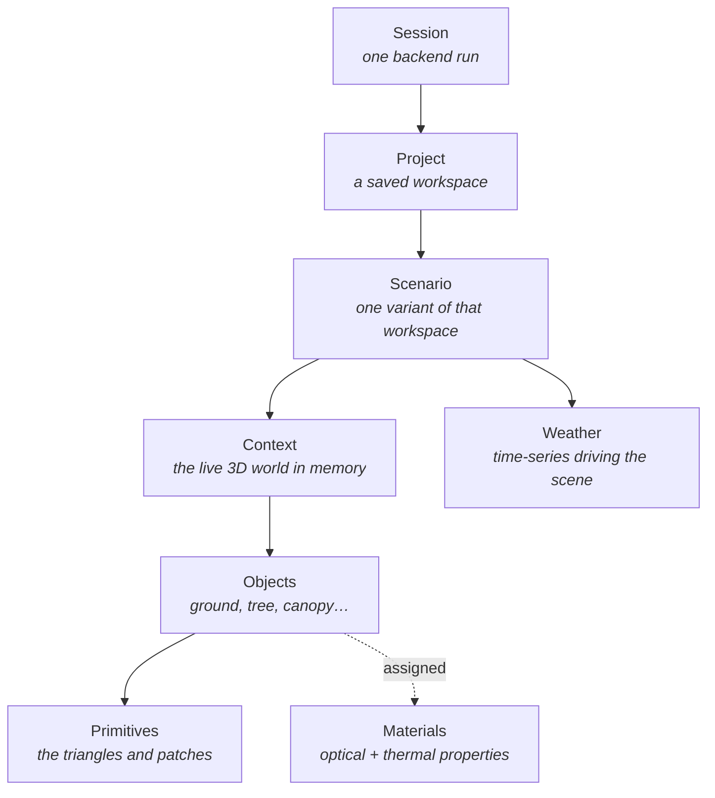

# Concepts

Helios has a small vocabulary that appears everywhere — in the UI, in the API routes, in the
database and in the source. Learning these seven words makes the rest of the documentation, and
the codebase, readable.



## The seven words

| Term | What it is | Where it lives |
|---|---|---|
| **Session** | One run of the backend process. A fresh UUID every launch. | In memory; sent as the `session-id` header on every request |
| **Project** | A named workspace the user creates and reopens. | A row in SQLite + a folder on disk |
| **Scenario** | A variant inside a project — its own scene, its own weather. Projects always have at least one. | A row in SQLite + a subfolder |
| **Context** | The live PyHelios C++ world for one scenario. The 3D truth. | RAM only, in the backend |
| **Object** | A user-facing scene item: a ground, a tree, a canopy. | SQLite row + a compound object in the Context |
| **Primitive** | The atomic geometry the engine actually stores — patches and triangles. | Inside the Context |
| **Material** | A named bundle of optical/thermal properties, assignable to objects. | SQLite; **global**, not per-project |

Read [Projects & storage](projects.md) next if you want to know what is saved and where;
[The Helios context](context.md) if you want to know why the backend holds so much memory.

## The one rule that explains the architecture

!!! important "The backend owns the truth. The renderer owns the view."

    Geometry, materials, weather and the scene itself live in the backend — in the PyHelios
    Context and in SQLite. The React/Redux side holds a **cached copy** for display.

    This is why nearly every user action becomes an HTTP request, why the app cannot do anything
    useful before the backend is ready, and why reloading the window loses nothing.

## Sessions, and why they exist

Every request from the renderer carries a `session-id` header, generated once per app launch
(`src/renderer/src/utils/session.ts`) and validated by `get_session_id` in
`app/core/dependencies.py`.

The backend keys all its in-memory state by that id:

```
SessionRegistry
  └── session_id
        └── project_id
              └── scenario_id → ScenarioContext (the live PyHelios world)
```

The backend also generates its **own** session id at startup
(`app/helios/context.py`), returned by `/health` and `/version`. It changes on every backend
restart, which is how the frontend can tell that the backend it is talking to is not the one it
started with — and therefore that its cached state is stale.

## What is *not* a concept

Two things that look like domain terms but are implementation details:

- **ProjectContext** — a legacy per-project context that predates scenarios. It still exists in
  `app/core/project_context.py` and is used by older routers, but new work belongs on
  `ScenarioContext`. See [The Helios context](context.md).
- **Geometry wire format v1 / v2** — how geometry is transferred to the viewport, not a modelling
  concept. See [Geometry & primitives](primitives.md).
