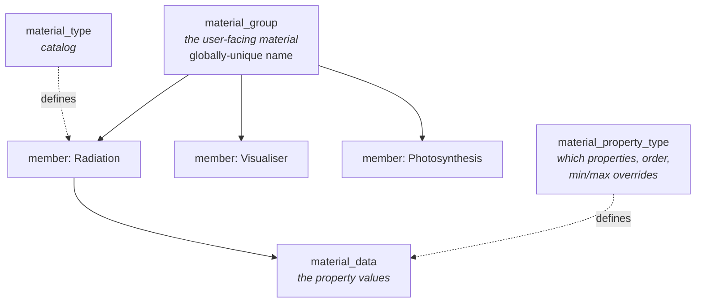

# Materials & textures

A **material** in Helios is a named bundle of physical properties that can be assigned to geometry
objects. Materials are **global** — they belong to the library, not to a project — which means one
material can be reused across every project and scenario.

!!! important "A material *is* a group"
    In the schema the user-facing object is called `material_group`, and the UI calls it a
    material. There is no separate "material" object above it. A group is created empty, then each
    "Parameter Group" card adds exactly one **material type** to it.

## The three layers

| Layer | Table | What it holds |
|---|---|---|
| The material | `material_group` | Name (globally unique, case-insensitive), provenance |
| Its members | `project_material` | One row per material **type** on this group |
| The values | `material_data` | The actual numbers/strings for each property |

`project_id` and `scenario_id` on `material_group` are **nullable provenance** — a record of where
the material was first created, both `ON DELETE SET NULL`. They do not scope it.

## Material types

Seeded by migration 017 and extended since. A group may carry at most one member of each type
(enforced by a `UNIQUE` constraint):

| Type | Covers |
|---|---|
| **Radiation** | Optical and thermal-radiative surface properties |
| **Energy Balance** | Surface energy balance model inputs |
| **Solar Position** | Sun position and atmospheric inputs |
| **Photosynthesis** | Farquhar photosynthesis model parameters |
| **Boundary Layer Conductance** | Conductance model selection and inputs |
| **Stomatal Conductance** | Stomatal sub-models and coefficients |
| **Visualiser** | What the viewport draws — colour, opacity, texture (added in migration 024) |

Which properties each type exposes, in what order, and with what min/max overrides, is data in
`material_property_type` — not code. Adding or re-ranging a property is a migration.

## Assignment: groups onto objects

A material is assigned to a geometry object as a whole group
(`POST …/objects/{id}/material-groups` with `{ group_id, sync }`). Dropping a material onto a
*group* of objects fans that out over its members, one call each.

Three tables are involved, and their relationship is the subtlest part of the schema
(migration 022):

- **`object_material_group`** — the user-facing assignment: one row per (geometry, material group)
  pair, carrying one `sync` flag.
- **`object_material`** — a **service-maintained materialized projection** of "groups assigned to
  this geometry × members of those groups".
- **`object_property_data`** — the frozen snapshot of property values as applied.

!!! note "Why the references are deliberately soft"
    `object_material.material_group_id` has **no foreign key**. Deleting or editing a library
    material must *not* cascade into another scenario's applied state — surviving orphan rows
    **are** the out-of-sync state that the material-sync API reports. That is a feature, not a
    dangling reference.

    `UNIQUE(scenario_object_id, material_type_id)` stays, though: it is the database-level enforcer
    of "no duplicate material type across the groups assigned to one geometry".

Mutating calls append the active `scenario_id` so the backend can reconcile and repaint that
scenario.

## Files: textures and spectral data

Two upload paths, and they behave differently.

| | Texture | Spectral data |
|---|---|---|
| Endpoint | `POST …/groups/{id}/files/{property}` | `POST …/groups/{id}/spectral` |
| Creates the member if absent? | **Yes**, in texture mode | **No** — the card must already be saved |
| Returns | The stored file record | `{ success, path }` only |
| Persisted by | The upload itself | The member's own Save, from the staged path |

A spectral file holds many `<globaldata_vec2 label="…">` spectra, and the upload only returns a
path — so `GET …/groups/{id}/spectral/labels` exists to read the labels back out of a stored file.
Without it, reopening a material could not offer the spectrum pickers.

**Deletion is reference-counted.** `DELETE …/groups/{id}/files` returns **409** while any material
or frozen geometry snapshot still references the file, so callers fire it only after a save has
dropped the reference.

## Serving textures to the viewport

Textures reach the 3D view through two endpoints:

- `GET /api/textures/defaults` — the built-in library textures, each with a name and a ready-to-use
  serve URL.
- `GET /api/textures/serve?path=…` — one image by its backend-side path.

How a texture without UVs is still drawn correctly is covered in
[Geometry & primitives](primitives.md#uvs-empty-is-a-meaning-not-a-gap).

## Related

- [Geometry & primitives](primitives.md) — what materials get assigned to.
- [Database & migrations](../dev/arch/database.md) — how migration 022 restructured all of this.
