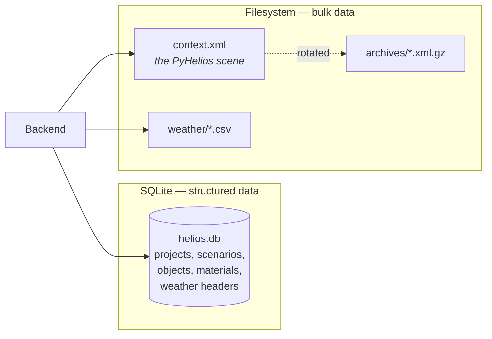
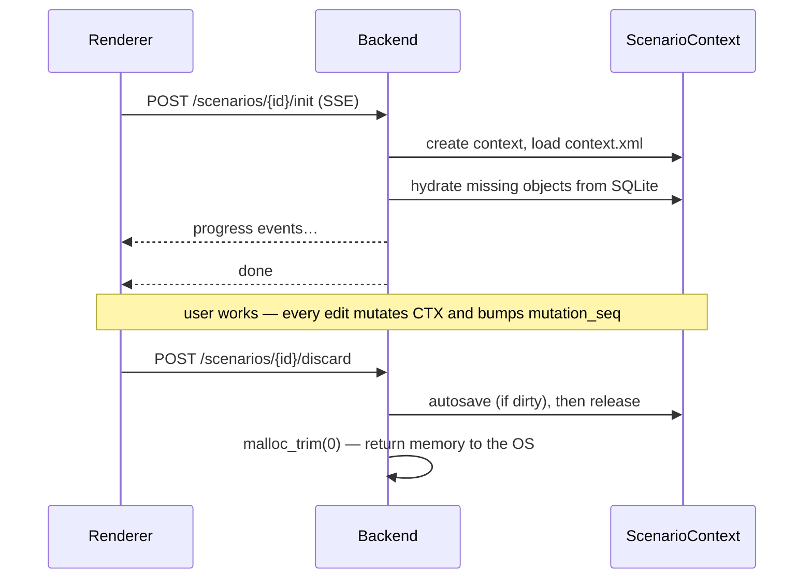

# Projects & storage

A **project** is the unit the user creates, names, reopens and deletes. A project contains one or
more **scenarios**; a scenario is where the actual scene and weather live. Everything the user
does is scoped to a `(project_id, scenario_id)` pair — which is why nearly every API route
carries both.

## Two stores, two jobs

Helios persists to **two** places, and knowing which holds what explains most of the app's
behaviour.



| Store | Holds | Why |
|---|---|---|
| **SQLite** | Project and scenario rows, the object list, material groups and their property values, weather headers, the data-type catalog | Queryable, relational, migratable |
| **`context.xml`** | The serialised PyHelios scene — every primitive | Far too large and too engine-specific for a relational schema. A 1000×1000 ground serialises to hundreds of megabytes |

!!! important "The database is the source of truth for *which* objects exist"
    `context.xml` is a **snapshot** of the engine state. If it is missing or stale, the backend
    rebuilds the scene from the object rows in SQLite — see `_hydrate` in the geometry service.
    That is why a corrupt or absent snapshot loses rendering work, but not the user's scene.

## On-disk layout

Rooted at the directory the Electron main process passes as `HELIOS_DATA_DIR` (see
[Backend sidecar](../dev/arch/backend.md)):

```
<userData>/backend-data/
├── heliosgui.db                     SQLite — everything structured
├── backend.pid                      {pid, cmdline, platform} — the orphan reaper's record
└── projects/
    └── <project_id>/
        └── scenarios/
            └── <scenario_id>/
                ├── context_file/
                │   ├── context.xml          the PyHelios scene
                │   └── archives/
                │       └── autosave_<ts>.xml.gz
                ├── weather/                 uploaded weather CSVs
                ├── metadata/                reserved
                └── export_files/            reserved
```

The paths are built by `Settings.scenario_dir()` in `app/core/config.py` — that is the single
source of truth, not a convention repeated across services.

Per platform, `<userData>` resolves to:

=== "macOS"
    `~/Library/Application Support/Helios`

=== "Windows"
    `%APPDATA%\Helios`  (`~/AppData/Roaming/Helios`)

=== "Linux"
    `~/.config/Helios`

Set in `getPlatformUserDataPath()` in `src/main/index.ts` — deliberately via
`app.setPath('userData', …)` rather than an environment variable, so the path is right even when
the app is launched from Finder.

## Saving: two compression tiers

| Tier | Format | Used for | Ratio |
|---|---|---|---|
| **gzip** | `archives/autosave_<ts>.xml.gz` | Rotated autosaves on disk | ~70% |
| **lzma** | `project_versions.scene_xml` BLOB in SQLite | Versioned snapshots | ~85–90% |

Only **one** archive is kept per scenario (`MAX_AUTOSAVE_ARCHIVES = 1` in
`app/helios/persistence.py`). The reason is size, not policy: a 613 MB `context.xml` gzips to tens
of megabytes, and the app has been tested against 1,300+ scenarios. The previous save is a
rollback point; older ones were never read by anything.

## Dirty tracking is a counter pair, not a flag

`ScenarioContext` tracks whether `context.xml` still matches memory using **two integers**, not a
boolean:

- `mutation_seq` — advances on every mutation.
- `saved_seq` — a save captures `mutation_seq` *before* writing, and stores it only if the write
  succeeded.

Equal means the file matches. With a plain boolean, a mutation landing *while a save is in flight*
would be cleared by that save completing, and the change would never reach disk. The counter pair
makes that case leave the scenario correctly dirty.

## Scenario lifecycle



`init` is the slow call and it runs **alone** — it creates the context and rebuilds the saved
scene into memory, streaming progress as Server-Sent Events. Every other scenario-scoped call is
fast once it has finished. That is why the boot saga
([ProjectBoot](../dev/arch/state.md)) runs it first and by itself.

`discard` autosaves and releases the context. Skipping it does not lose data — the next `init`
rebuilds from disk and SQLite — but it does leave a gigabyte-scale context resident until the
backend exits.

## Migrations

The schema is 30+ ordered `.sql` files in `app/db/migrations/`, applied at startup by
`run_migrations()`. See [Database & migrations](../dev/arch/database.md) for how they are applied
and why the runner is unusually defensive.
