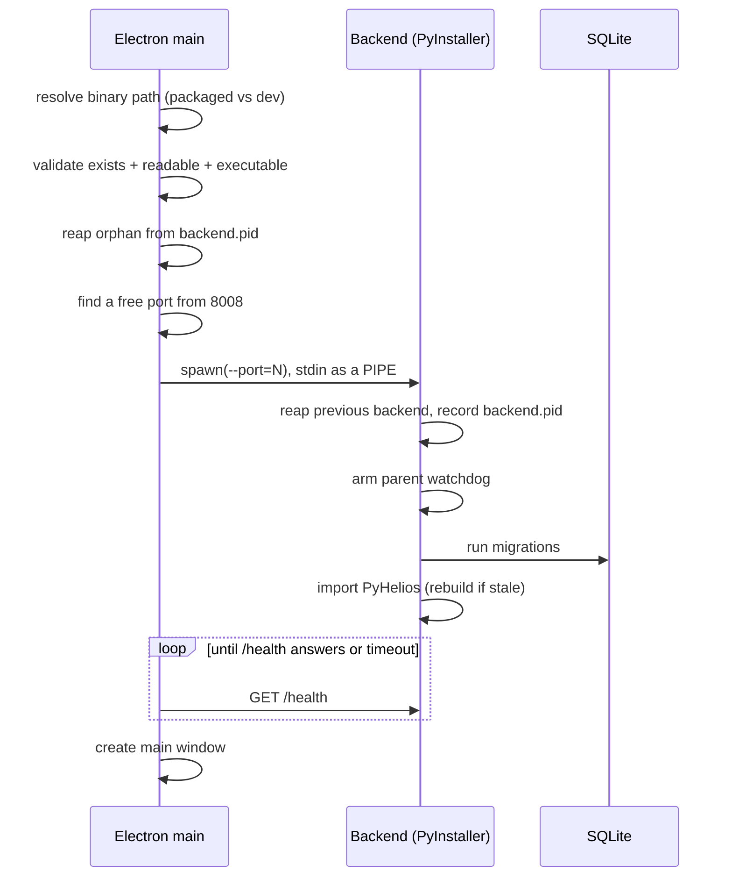
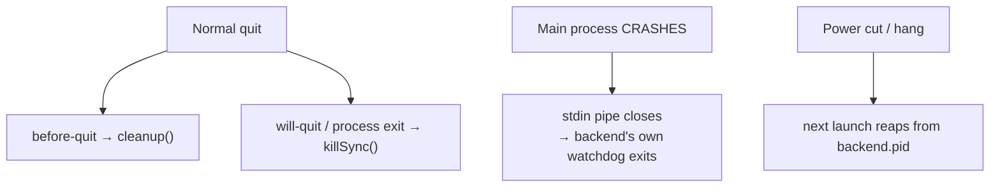

# Backend sidecar

The backend is a FastAPI application bundled by PyInstaller into a single executable and launched
as a **child process** of the Electron main process. `src/main/backend-manager.ts` owns that
process for its whole life.

This page is mostly about one problem: **making sure the backend never outlives the app.** A
backend holding a 1.4 GB scenario context, the port and the SQLite file until the machine reboots
is the worst failure mode this app has, and most of the code here exists to prevent it.

## Startup sequence



### Path resolution

| Mode | Path |
|---|---|
| Packaged | `<resourcesPath>/backend/heliosgui_backend[.exe]` |
| Dev | `<cwd>/resources/backend/{mac,win,linux}/heliosgui_backend[.exe]` |

Both PyInstaller layouts are handled: with `--onedir` the resolved path is a *directory* and the
executable is one level inside it; with `--onefile` it is the executable directly.

### Port selection

The desired port is **8008**. `isPortFree` actually attempts a `bind()` on `127.0.0.1` rather than
consulting a list of well-known ports, because any process can hold a port without it being
"well-known". If 8008 is busy the manager walks forward up to 50 ports.

Before probing, it retries 8008 five times at 100 ms intervals. A just-reaped process does not
release its port on the same tick, and a single probe a millisecond too early would send the app
to 8009 anyway — reaping the orphan and taking none of the benefit.

!!! warning "Landing on 8009 is a symptom, not a solution"
    It almost always means an **orphan** is still holding 8008 along with the SQLite file and its
    whole scenario context. Starting a second backend on 8009 then contends with it for the
    database — which is what makes the project list come back empty after a crash. The manager
    logs a `WARNING` naming the situation and suggesting `pgrep -af heliosgui_backend`.

### Readiness

The manager polls `GET /health` every 250 ms until it answers.

| Context | Timeout |
|---|---|
| Normal use | 30 s |
| Under e2e automation | 120 s |

Shipped behaviour is unchanged by the longer e2e budget — a user with a genuinely broken backend
still sees the error after 30 s. The raise exists because on one CI run, one of seven sessions
took 32.4 s to answer `/health` while the other six took 2.0–3.6 s; missing the cap by 2.4 s made
the app quit before opening its window.

If the backend never becomes ready, the main process shows an error dialog and quits **without
creating a window** — the user sees the failure immediately rather than a UI that looks ready.

## Keeping the backend from being orphaned

There are **four** independent mechanisms. They overlap on purpose, because each covers a case the
others cannot.



### 1. Graceful stop (`before-quit`)

`backendManager.cleanup()` → `stopBackend()`: `SIGTERM`, then force-kill the tree after 5 s. On
Windows it goes straight to `taskkill /T /F`, because `child.kill()` only targets the direct PID
and a `--onedir` backend spawns a bootloader child — killing just the parent orphans the real
backend and blocks reinstall.

### 2. Synchronous reaper (`will-quit`, `process.exit`, `uncaughtException`)

Electron does **not** await the async `before-quit` handler, so it can be cut off mid-cleanup.
`killSync()` runs from the synchronous handlers as the guaranteed reaper.

In the `uncaughtException` handler every step is independently guarded and the exit is
unconditional. The ordering matters: `writeEarlyLog` falls back to `console.error`, and a console
write on a broken stdout can itself throw — which would skip both `killSync` and the exit. **On a
death path, cleanup may never sit downstream of logging.**

### 3. The stdin liveness pipe

This is the only mechanism that survives a **crash**, and it is the important one.

The manager spawns the backend with `stdio: ['pipe', 'pipe', 'pipe']` and **never writes to
stdin**. It is not a channel — it is a liveness signal. The main process holds the write end open
for as long as it lives, and the OS closes it the moment that process dies, for any reason,
including an abort that runs no cleanup at all. The backend blocks on a read at the other end; the
read returns empty; it exits.

Why a pipe rather than the alternatives:

| Alternative | Problem |
|---|---|
| `getppid()` polling | POSIX-only, and under PyInstaller `--onefile` the bootloader sits between the two so the pid never matches |
| Polling a recorded pid | Races pid reuse |
| Windows Job Object | Works, but needs an FFI native module — this app ships no runtime native code and `npmRebuild` is off |

!!! danger "Windows reads a handle, not the pipe"
    On Windows the pipe read **deadlocks**. A thread parked in a blocking CRT read on fd 0 and a
    main thread loading `libhelios.dll` deadlock each other — measured, three runs, one variable:

    | stdin | Result |
    |---|---|
    | `'ignore'` | gate never arms → ready in 1.58 s |
    | `'pipe'`, fed bytes | read never blocks → ready in 1.57 s |
    | `'pipe'`, idle | read **blocks** → hung past 40 s |

    So on Windows the backend waits on the parent's process **handle**
    (`WaitForSingleObject`), using `HELIOS_PARENT_PID`. It never touches fd 0.

The backend arms the watchdog only when stdin is genuinely a pipe — `S_ISFIFO` **or** `S_ISSOCK`.
The socket case is the one that matters: Node's `stdio: 'pipe'` is a `socketpair()` on POSIX, so
fd 0 is a socket, not a FIFO. Checking `S_ISFIFO` alone looks right, passes a unit test built on
`os.pipe()`, and never arms under the spawn the app actually uses.

### 4. The pid-file reaper

`<dataDir>/backend.pid` holds:

```json
{"pid": 7539, "cmdline": "heliosgui_backend\u0000--port=8008", "platform": "win32"}
```

Both sides read it. The backend reaps on POSIX (it has `/proc` and `ps`); the Electron app reaps
on Windows (it has `taskkill /T /F` and WMI). The manager reaps **before choosing a port**, not
after — the backend's own reap happens once it is already running, by which time 8009 is committed
and the drift is permanent.

**Pid reuse is the hazard**, so a recorded pid is never killed on the strength of the pid alone.
Identity is reduced to `(executable stem, port)` by `backendIdentity()` in
`src/main/backend-identity.ts`, because the recorded and live command lines can never be
string-equal across platforms:

| Source | Shape |
|---|---|
| Linux `/proc/<pid>/cmdline` | NUL-separated, argv[0] as exec received it |
| macOS `ps -o command=` | space-separated |
| Windows recorded (`sys.argv`) | NUL-joined, bare `heliosgui_backend` |
| Windows live (WMI `CommandLine`) | the raw `CreateProcess` string, `heliosgui_backend.exe` |

The `.exe` suffix is deliberately **not** part of the identity — carrying it made every Windows
match fail. That module is split out from `backend-manager.ts` purely so it can be unit-tested:
`backend-manager` imports `electron`, which cannot load under Vitest.

!!! note "Every path out of the reaper logs"
    A reaper that silently declines is indistinguishable from one that works — until the day it
    matters. "No identity" (a hand-run dev backend, or a recycled pid) and "identity differs" are
    logged separately and deliberately.

## Environment passed to the child

| Variable | Value |
|---|---|
| `HELIOS_DATA_DIR` | `<userData>/backend-data` — read by pydantic settings via `AliasChoices` |
| `HELIOS_LOG_DIR` | `<userData>/logs` |
| `HELIOS_PARENT_PID` | The main process pid, for the Windows watchdog |

`HELIOS_PARENT_PID` is an **env var and not a CLI flag** on purpose: `backend_wrapper.py` parses
argv with `argparse`, which *exits* on an unrecognised argument. Shipping `--parent-pid` before the
backend understood it would have stopped the app starting at all. An unread env var is ignored, so
the two sides can ship in either order.

## Backend startup, inside the process

`app/core/lifespan.py` runs four steps, in order:

1. Configure logging
2. Ensure data directories exist
3. Run database migrations
4. Validate PyHelios availability

Steps 2 and 3 are the ones that fail on real machines, so each maps to a **distinct exit code**
and one structured, greppable `[startup-fatal]` log line:

| Code | Meaning | Remedy shown |
|---|---|---|
| 10 | Migration failed | Restart; contact support with `backend.log` |
| 11 | Cannot create/write the data directory | Check folder permissions |
| 12 | Database is locked | Another copy of Helios may be running |
| 13 | Database is malformed | Restart; if it persists, reset Helios data |
| 14 | Bundle incomplete (missing migrations folder) | Reinstall Helios |

`_abort()` uses `os._exit` so the exact code reaches the parent — a `SystemExit` raised inside the
async lifespan is caught by uvicorn and re-reported as a generic exit 3, which is precisely what
these codes exist to avoid. Genuinely unexpected errors are deliberately **not** caught, so real
bugs still fail loudly.

## Logs

| File | Written by | Contents |
|---|---|---|
| `<userData>/logs/backend.log` | `BackendManager` | Path resolution, validation, spawn args, health polling, the backend's own stdout/stderr |
| `<userData>/logs/app-startup.log` | `writeEarlyLog` in `src/main/index.ts` | Everything before the manager exists — userData path, single-instance lock, crashes |

The manager also keeps the last 500 stdio lines in memory and includes the last 20 in any startup
error message.

Requests slower than 2 seconds get their own `[slow]` line from a FastAPI middleware, so "the app
feels slow" becomes a path and a number.

## Related

- [Process model & IPC](processes.md) — how the renderer reaches this process.
- [Database & migrations](database.md) — what step 3 above actually does.
- [Troubleshooting](../troubleshooting.md) — symptoms and fixes.
