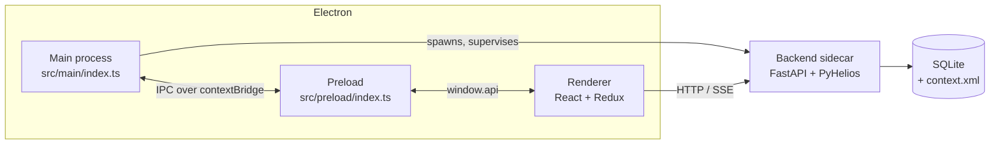
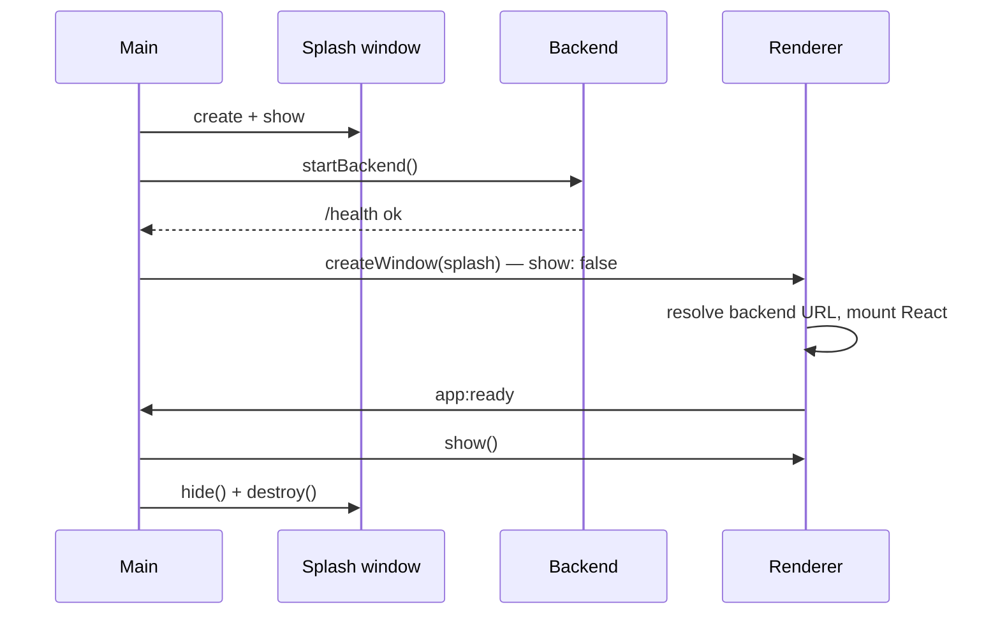

# Process model & IPC

Helios runs as **three Electron processes plus one Python child process**.



## Responsibilities

| Process | Source | Owns |
|---|---|---|
| **Main** | `src/main/index.ts`, `backend-manager.ts`, `backend-identity.ts` | Window lifecycle, the application menu, native dialogs, spawning and supervising the backend |
| **Preload** | `src/preload/index.ts` | The only bridge between renderer and main; exposes a narrow `window.api` via `contextBridge` |
| **Renderer** | `src/renderer/src/` | All UI, the Redux store, sagas, the Three.js viewport |
| **Backend** | `helios-desktop-backend/` | The PyHelios 3D context, all geometry/material/weather state, SQLite persistence |

## Two channels, not one

This is the part that surprises people.

**1. Renderer → Main** goes over Electron IPC through the preload bridge. Desktop concerns only:
windows, dialogs, backend status.

**2. Renderer → Backend** does **not** go through main. The renderer talks to FastAPI directly
over HTTP (axios) and SSE (`EventSource`), against the base URL resolved in
`src/renderer/src/utils/constants.ts`:

```ts
(window as any).__APP_BASE_URL__ ?? (import.meta.env.DEV ? '' : import.meta.env.VITE_BACKEND_URL)
```

In development the base URL is empty and requests go to same-origin `/api/*`, which the Vite dev
server proxies. In a packaged build Electron loads from `file://` and must reach the backend
directly, so the build-time `VITE_BACKEND_URL` applies — unless `__APP_BASE_URL__` overrides it,
which it does whenever the sidecar bound a port other than 8008.

!!! important "Why the split matters"
    Any state that must survive a reload — geometry, materials, the project itself — lives in the
    backend, not in Redux. Redux holds view state and cached copies. See
    [State management](state.md).

### Resolution order at startup

`main.tsx` awaits `window.api.getBackendUrl()` and sets `window.__APP_BASE_URL__` **before**
dynamically importing `App` and `configureStore`. `constants.ts` captures `BASE_URL` at module
evaluation, so a static import would bake in the stale build-time value instead of the port the
backend actually bound to.

## The IPC surface

Everything the renderer can ask of the main process, from `src/preload/index.ts`. Channel names
are `feature:verb`; request/response uses `ipcMain.handle` + `ipcRenderer.invoke`.

| `window.api.*` | Channel | Returns |
|---|---|---|
| `openFile(filters)` | `dialog:openFile` | Path or `null` |
| `saveFile(filters, defaultPath?)` | `dialog:saveFile` | Path or `null` |
| `readFile(path)` | `fs:readFile` | UTF-8 contents |
| `writeFile(path, content)` | `fs:writeFile` | — |
| `getBackendStatus()` | `backend:getStatus` | `{ running, pid }` |
| `getBackendUrl()` | `backend:getUrl` | `"http://127.0.0.1:8009"` or `null` |
| `startBackend()` / `stopBackend()` | `backend:start` / `backend:stop` | Status |
| `windowMinimize()` | `window:minimize` | — |
| `windowToggleMaximize()` | `window:toggleMaximize` | New maximized state |
| `windowTitleBarDoubleClick()` | `window:titleBarDoubleClick` | — |
| `windowClose()` | `window:close` | — |
| `windowIsMaximized()` / `windowIsFullScreen()` | `window:isMaximized` / `window:isFullScreen` | boolean |
| `onFullScreenChange(cb)` | `window:fullScreenChange` | Unsubscribe function |
| `getPlatform()` | `window:getPlatform` | `process.platform` |
| `appReady()` | `app:ready` (send, not invoke) | — |

`contextIsolation: true` and `nodeIntegration: false` are non-negotiable. The renderer never
imports `electron` and never touches `ipcRenderer` directly.

File dialogs are attached to the calling window so they become modal sheets on macOS. Without
that, the dialog floats free and the user can click back into the app while it is still open,
leaving the renderer's "Opening…" state stuck.

## Window creation

The window is **frameless** — the renderer paints its own title bar, which is why the window
control IPC above exists.

=== "macOS"
    `titleBarStyle: 'hidden'` keeps the native traffic lights, so the OS handles the fullscreen
    hover-reveal for free. `trafficLightPosition` centres them in the app's 45px header row.

=== "Windows / Linux"
    Fully frameless (`frame: false`). The renderer paints every window control.

The window opens at `min(workAreaSize, 1920×1080)`, in device-independent pixels so it stays
sensible on Retina displays, and with `backgroundColor: '#121212'` matching `--color-bg` — without
that the native window flashes white between `show()` and the renderer's first paint.

### The splash handoff



The main window deliberately does **not** use Electron's `ready-to-show`. That event fires after
HTML/CSS parse, but the renderer still has an async backend-URL IPC, two dynamic imports and a
React mount ahead of it. Instead the initial screen sends `app:ready` from its own mount effect, so
the splash holds until a screen has actually painted.

A 10-second fallback timer shows the window anyway if the renderer crashes before sending it — the
user should never be left staring at a splash forever.

## Single instance

The app holds a single-instance lock, acquired **after** `setUserDataPath()` so the lock file uses
the correct userData directory.

A second launch fires `second-instance` in the running app instead of starting a new process:

| Argv | Behaviour |
|---|---|
| Contains `--new-window` | Open another window |
| No windows open | Create one |
| Otherwise | Restore, show and focus the existing window |

A plain launch **must** focus what is already open — otherwise every click on a pinned taskbar or
dock icon would stack up another window, each with its own backend. `--new-window` is supplied by
the Windows jump list, the macOS dock menu, and the Linux `.desktop` action.

The lock is skipped under e2e automation, so a test instance is never killed by (or killing) a
dev instance.

## Crash reporting

Three observers write to `app-startup.log`:

| Event | Logs |
|---|---|
| `render-process-gone` | `reason`, `exitCode`, URL |
| `child-process-gone` | `type`, `reason`, `exitCode`, `name` |
| `uncaughtException` | The stack, then reaps the backend, then exits |

`reason` is the point of all of this. Electron reports `'oom'` for the failure this app is prone
to — a scenario context is roughly 1.4 GB, and on a machine low on memory whichever process
allocates next is the one refused. That is a one-word answer to a question that otherwise needs a
core dump.

!!! warning "A diagnostic must never escalate the fault it reports"
    The observers read `contents.getURL()` defensively, because the WebContents is often already
    destroyed by the time the handler fires — and every accessor on a destroyed WebContents
    throws. An uncaught throw there would become an `uncaughtException` and exit the app, turning
    a renderer crash Electron would have survived into a full shutdown.

    For the same reason `safeLog()` swallows everything: `writeEarlyLog` falls back to
    `console.error`, and a console write on a broken stdout can itself throw — which on the
    `uncaughtException` path would skip the backend reaper and the exit beneath it.

## Related

- [Backend sidecar](backend.md) — how the fourth process is launched and supervised.
- [State management](state.md) — what happens on the renderer side of channel 2.
