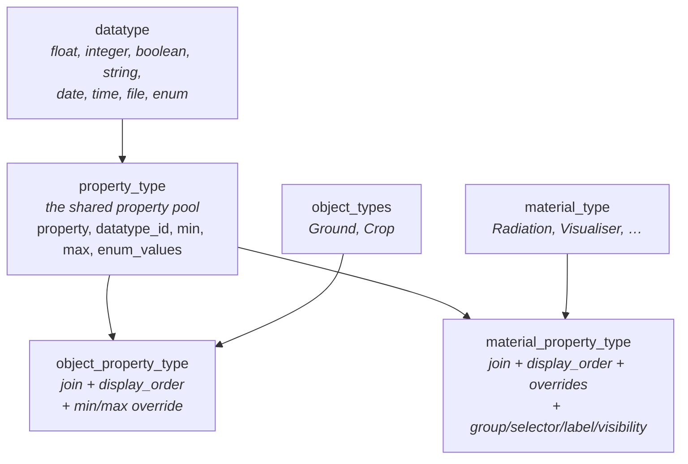
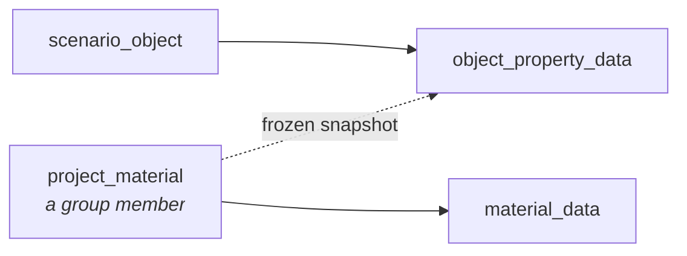
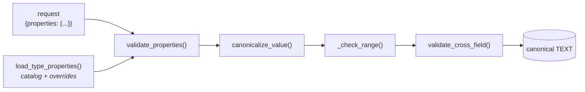
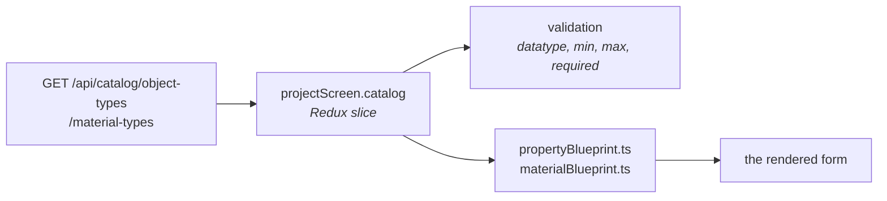

# The property system

Geometry objects and materials do not have hardcoded fields. A Ground's `length`, a Radiation
material's `emissivity`, their datatypes, their valid ranges, their display order and their enum
options are all **rows in catalog tables** — and the values themselves are stored in an
**entity-attribute-value** (EAV) store rather than typed columns.

!!! important "The consequence, stated once"
    **Adding a property, or a whole object or material type, is a migration — not code.**

    A developer asked to "add a canopy type" will reach for TypeScript. That is the wrong file.
    See [Add an object type](../recipes/add-object-type.md).

This page explains the mechanism. It is the prerequisite for reading the geometry or materials
code at all.

## Why it is built this way

The right-hand properties panel renders a different form for every object type and every material
type — a Ground has ten intrinsic parameters, Photosynthesis has fourteen inside a collapsible
"Farquhar model" group, Stomatal Conductance has four mutually-exclusive sub-models.

Hardcoding those forms would mean a frontend change, a backend change, a schema change and a
release for every new parameter a plant scientist asks for. Instead the catalog describes them,
one endpoint serves the description, and the form builds itself.

## The catalog



| Table | Holds |
|---|---|
| `datatype` | The eight primitive kinds. Seeded once; you will never add to this |
| `property_type` | **One row per property name, globally unique.** Its datatype, default `min`/`max`, and `enum_values` as JSON |
| `object_types` / `material_type` | The types themselves |
| `object_property_type` | Which properties a *object* type has, in what order, with optional range overrides |
| `material_property_type` | The same for material types, **plus** grouping, selector, label and visibility metadata |

Two details that matter:

**`property_type.property` is globally unique (`COLLATE NOCASE`).** It is a shared pool — the same
property row can be linked to several types. So property names must stay unique across the whole
application, which is why the four stomatal sub-models use `bwb_gs0`, `bbl_gs0`, `medlyn_gs0`
rather than one `gs0`.

**Ranges are overridable per link.** `property_type.min/max` is the default;
`min_override`/`max_override` on the join row wins. That is how the same property can be
constrained differently on two types.

## Where values live



| Table | Holds | Keyed by |
|---|---|---|
| `material_data` | A material member's property values — **library truth** | `(project_material_id, property_type_id)` |
| `object_property_data` | **Two different things** — see below | two partial unique indexes |

!!! warning "`object_property_data` is dual-purpose"
    The same table stores both, distinguished by whether `project_material_id` is NULL:

    | `project_material_id` | Meaning | Unique index |
    |---|---|---|
    | **NULL** | The object's own **intrinsic** geometry parameters (`length`, `position_x`…) | `idx_opd_intrinsic` |
    | **NOT NULL** | A **frozen snapshot** of a material's values as applied to this object | `idx_opd_frozen` |

    The frozen rows carry a composite foreign key to `object_material`, so they cascade when an
    assignment is removed. That is what makes `sync=0` work — a material edited in the library
    does not touch an object that froze its values. See
    [Materials & textures](../../concepts/materials.md).

Every value is stored as **TEXT** in a canonical form. Nothing in the schema enforces the datatype
or the range; that is entirely the service layer's job, driven by the catalog.

## Canonical storage forms

`canonicalize_value()` in `app/services/eav_validation.py` converts native JSON to the stored TEXT:

| Datatype | Canonical form | Notes |
|---|---|---|
| `float` | Decimal string, ≤7 dp, **half-even** rounding, trailing zeros and dot stripped | `1.50` → `1.5`, `2.0` → `2` |
| `integer` | Base-10 string | A float is accepted only if integral |
| `boolean` | `'0'` / `'1'` | A real JSON boolean is required |
| `string` | As-is | |
| `date` | `YYYY-MM-DD` | |
| `time` | `HH:MM:SS`, 24h | Seconds always present |
| `file` | Project-relative path, or `plugin:<name>/<file>` | |
| `enum` | An exact token from `enum_values` | |

Reading back, `decode_value()` returns native JSON — and note that a `float` whose value is
integral comes back as an **int** (`2.0` → `2`), for values under `1e15`.

Two numeric guards worth knowing:

- More than 7 decimal places is rejected outright (`TOO_MANY_DECIMALS`) rather than silently
  rounded.
- The quantize step uses a 60-digit decimal context, because Python's default 28-digit precision
  overflows for values ≥ 1e21.

## Validation pipeline



API payloads carry **one flat `properties` object** keyed by property name with native JSON
values. `validate_properties()` walks it, looks each key up in the type's catalog, and returns
`{name: canonical_text_or_None}` — where `None` means the client explicitly cleared the value and
the row is removed.

### Error codes

All use the house shape `detail: { error, code }`:

| Code | Raised when |
|---|---|
| `UNKNOWN_PROPERTY` | The name is not a property of this object type |
| `MATERIAL_TYPE_MISMATCH` | Same, on the material side — a distinct code by design |
| `DATATYPE_MISMATCH` | Wrong JSON type for the datatype |
| `TOO_MANY_DECIMALS` | More than 7 decimal places |
| `INVALID_NUMBER` | Non-finite, or unrepresentable |
| `VALUE_OUT_OF_RANGE` | Outside `min`/`max`, message quoting both bounds |
| `ENUM_INVALID_OPTION` | Not a token in `enum_values` |
| `MISSING_REQUIRED_PROPERTY` | A required property is absent or cleared |
| `VISUALISER_MODE_CONFLICT` | A colour field sent in texture mode, or vice versa |
| `UNKNOWN_DATATYPE` | **500** — the catalog names a datatype the code cannot handle |

### Cross-field rules

Some constraints cannot be expressed by one property's range. `validate_cross_field()` holds
those; today it is Ground's texture repeat, which must not exceed the resolution
(`texture_x ≤ resolution_x`). On an update it is given the existing values merged with the patch,
so a partial edit is still checked against the whole.

### Required properties live in Python, not the catalog

```python
REQUIRED_OBJECT_PROPERTIES = {
    "Ground": {"length", "breadth", "resolution_x", "resolution_y",
               "position_x", "position_y", "position_z", "rotation_z",
               "texture_x", "texture_y"},
}
REQUIRED_MATERIAL_PROPERTIES = {"Visualiser": VISUALISER_COLOUR_FIELDS}
```

There is **no `required` column** in the catalog. These dicts are the single source for both the
catalog response and create-time validation. A new type with no entry here requires nothing —
which is a silent, not a loud, failure.

Every Ground parameter is required, including position and rotation: the create form seeds them
all with defaults, so clearing any one must fail rather than quietly store nothing.

## Material-only metadata

The material link table carries four extra concepts the object side has no equivalent for. The
loader reads them with `getattr(..., None)`, so object types simply get `None`.

| Column | Migration | Purpose |
|---|---|---|
| `group_name` | 027 | Renders the property inside a named collapsible group ("Farquhar model") |
| `selector_property` + `selector_value` | 027 | Makes a group conditional on an enum's current value |
| `label` | 027 | Display-only. **May repeat** across sub-models ("gs, o") — never a storage key |
| `visibility` | 029 | `editable` \| `external` \| `computed` |

### Selector gating

Stomatal Conductance has four mutually-exclusive sub-models chosen by the `stomatal_model` enum.
`member_property_values()` returns only the chosen one's parameters.

Two subtleties in that function, both deliberate:

**Comparison is lowercase text.** `selector_value` is a catalog TEXT column while the member's
value is already decoded — so a *boolean* selector arrives as Python `False`, and
`False == 'false'` would never match, hiding the group in every mode.

**Only a *contested* selector excludes** — one that several groups compete for. `stomatal_model`
carries four sub-models, so returning them all would return three the member never chose. But
Radiation's Spectrum group is alone on its selector: there is no rival, so withholding it would
only hide values the member really holds. *A saved value you cannot read back is worse than one
never accepted.*

### Visibility

The catalog endpoint returns only `visibility='editable'`. But **validation and apply keep every
property** — `load_type_properties` is unfiltered — so hidden values still validate and still
reach the engine.

- `external` — set elsewhere (the Weather panel, the project header); never in the material form.
- `computed` — produced by another model; hidden while that model runs. Tagged now so a future
  "disable the model and enter the input yourself" feature needs no re-seed.

## The read path



The catalog gives a **flat, ordered** list — enough to validate, not enough to lay out. The
blueprint files in `containers/Geometry/` and `containers/Materials/` add the presentation layer:
grouping under headings, short field labels ("X" for `position_x`), fields per row, and seed
values for the create form.

!!! note "Why presentation is deliberately separate"
    The catalog stays the source of truth for validation, so a backend property change reshapes
    validation automatically. Layout stays intentional and hand-authored.

    The join degrades safely in both directions. A blueprint field naming a property the catalog
    does not have is **skipped**; a catalog property the blueprint never references is reported in
    `unmappedProperties` and — because `appendUnmapped` defaults to true — still rendered, in a
    trailing two-column group with a humanized label (`resolution_x` → "Resolution X"), in catalog
    display order.

    So adding a property backend-side and forgetting the blueprint costs you layout, not the
    field.

## What is data and what is code

The table to consult before writing anything:

| Change | Where |
|---|---|
| Add a property to a type | **Migration** — `property_type` (if new) + the join row |
| Change a valid range | **Migration** — `min`/`max`, or `min_override` on the link |
| Change display order | **Migration** — `display_order` |
| Add an enum option | **Migration** — `enum_values` JSON |
| Group properties, or gate them on a selector | **Migration** — `group_name` / `selector_*` |
| Hide a property from the form | **Migration** — `visibility` |
| Add a new object or material type | **Migration**, then three code touch-points |
| Mark a property required | **Code** — `REQUIRED_*` in `eav_validation.py` |
| Add a cross-field rule | **Code** — `validate_cross_field()` |
| Add a new *datatype* | **Code** — `canonicalize_value()` + `decode_value()`, then seed |
| Lay out the form | **Code** — the blueprint file |

## Name rules

Not strictly part of the EAV system, but it lives in the same module and applies to every geometry,
material and group name:

- 20 characters maximum, including spaces; non-empty after stripping.
- Control characters are rejected explicitly, and that check is load-bearing: `str.strip()` leaves
  a NUL in place and Python counts it, but SQLite's `length()` **stops at the first NUL** — so
  `"\x00abc"` would pass a naive length check and then die on the `CHECK` constraint at commit,
  surfacing as a bogus "name already exists".
- `next_default_name()` auto-numbers case-insensitively: `Ground.001`, `Material.001`.

## The other catalog: weather

!!! warning "Two catalog systems, easily confused"
    Weather columns use a **completely separate** catalog — `helios_data_types` and `data_units` —
    which the property system knows nothing about. `property_type` has **no unit column**.

    | | Property catalog | Weather catalog |
    |---|---|---|
    | Tables | `datatype`, `property_type`, `*_property_type` | `helios_data_types`, `data_units` |
    | Drives | Geometry + material forms | Weather table columns |
    | Units | None | Affine conversion: `value_in_base = value × to_base_factor + to_base_offset` |
    | Seeded by | 017 and later | 009, 011–016 |

    `data_units` enforces at most one base unit per data type via a partial unique index. See the
    weather feature guide.

## Related

- [Add an object type](../recipes/add-object-type.md) — the recipe this page unlocks.
- [Database & migrations](database.md) — how to write the migration safely.
- [Materials & textures](../../concepts/materials.md) — what the material side builds on top.
- [Geometry & primitives](../../concepts/primitives.md) — objects versus primitives.
