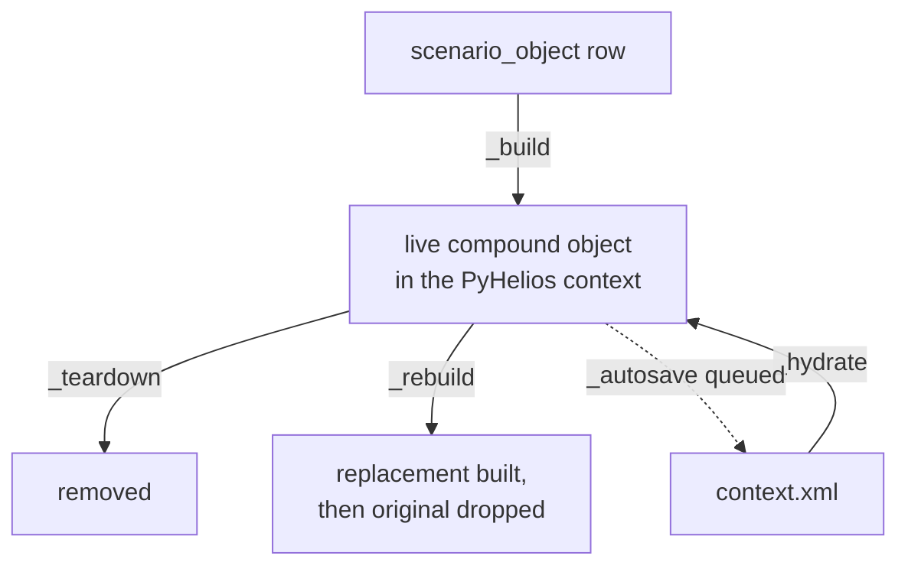
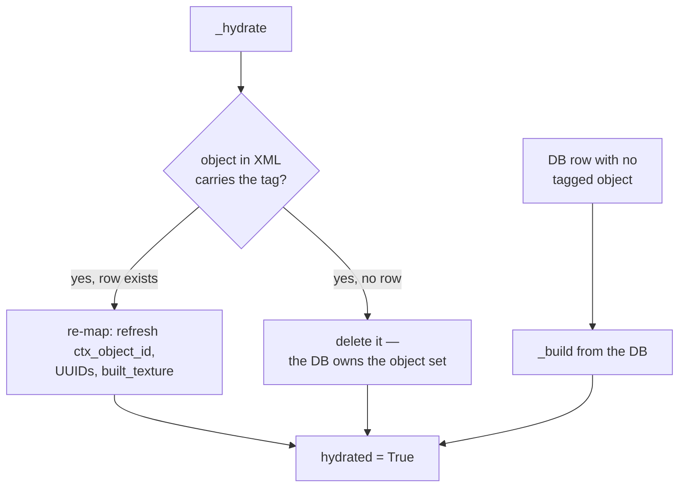
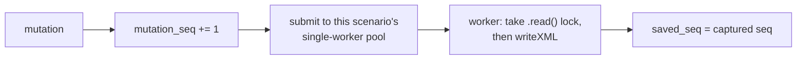

# Scene build & hydration

How a database row becomes live geometry in the PyHelios context, and how it gets back after a
restart.

This is the heart of `scene_object_service.py` (1,950 lines) and it is shared by **both** geometry
and materials — which is why it lives here rather than in either feature's own page.

!!! important "The governing rule"
    **The database owns the object set. `context.xml` is a cache.**

    If the snapshot is missing, stale or partial, hydration rebuilds from the DB. That is what
    makes a lost save cost render time rather than user data.

## Four operations



| Function | Does |
|---|---|
| `_build` | Row → live geometry. Captures the object id, persists UUIDs, applies materials |
| `_teardown` | Removes the live object and its runtime entries |
| `_rebuild` | Replaces the geometry — **builds first, drops second** |
| `_hydrate` | Re-maps a loaded `context.xml` back onto DB rows, once per scenario |

All four are wrapped in `@_with_scenario_lock`, which takes that scenario's write lock and is
re-entrant, so the nesting (`_apply_assignment_change → _rebuild → _teardown + _build`) is safe.

## Building

`_build` reads the intrinsic properties, resolves the surface, calls `addTileObject`, and tags the
result.

### Surface resolution

`_winner_surface` decides what gets baked, from the precedence-winning material assignment:

| Result | Meaning |
|---|---|
| `('texture', path)` | Bake this texture with the intrinsic `texture_x/y` repeat |
| `('colour', rgb)` | An **untextured** tile; the solid colour is painted afterwards via the per-object material label |
| `('soil', None)` | No Visualiser member — an unstyled ground reads as soil |

!!! note "Why an unstyled ground can silently become a colour tile"
    A texture caps the subdivision at its pixel resolution. A ground finer than the default soil
    texture allows could then not be built *at all* — assigning any material, unassigning, or
    editing the resolution all end in a repaint that the engine refuses, and the ground gets stuck
    rejecting everything.

    That cap belongs to a texture the user **chose**. So when the default soil texture would
    refuse the resolution, `_winner_surface` returns a plain colour tile instead, which has no cap.

### The contract every build must keep

- **Always a `TileObject`**, even untextured, so a stable `ctx_object_id` exists for in-place
  edits.
- **Tag it**: `ctx.setObjectDataUInt(ctx_object_id, "helios_gui_so_id", so.id)`. Object *data*
  survives a `writeXML`/`loadXML` round trip; object ids and primitive UUIDs do **not**. This tag
  is the only thing that makes hydration possible.
- **On failure, leave the row consistent** — `helios_uuids=[]`, `ctx_object_id=None`, not
  registered — and raise. Hydration will skip and retry it later.

The one build failure a user can act on is a resolution above the texture's pixel cap, which is
translated into **422 `RESOLUTION_TOO_HIGH`** rather than a 500.

## Rebuilding: build first, drop second

`_rebuild` builds the replacement **before** dropping the original, and restores the old ids if
the build raises.

!!! danger "The bug that ordering prevents"
    Tearing down first meant a build that raised left **nothing** behind. The object was gone from
    the context and from `persisted_objects`, so every later edit and every material write
    silently no-opped — they all guard on membership — and the next autosave wrote a `context.xml`
    without it.

    That is reachable: the engine refuses a subdivision above the ground texture's pixel
    resolution, so a rejected resolution edit **destroyed the ground it rejected**.

Build-then-drop is also what the engine itself does when it regenerates a tile, which is why the
in-place path could fail harmlessly.

## Rebuild or patch in place?

Not every property change needs new primitives. `_apply_intrinsic_change` decomposes the change
into engine operations where it can:

| Changed property | Operation |
|---|---|
| `position_x/y/z` | `translateObject` with the delta |
| `rotation_z` | `rotateObject` about the object's own centre |
| `length` / `breadth` | `scaleObject`, about centre |
| `resolution_x/y` | `setTileObjectSubdivisionCount` |
| `texture_x` / `texture_y` | **Rebuild** — the repeat is baked in; there is no in-place setter |
| Anything else | **Rebuild** |

Three escape hatches inside that path, each with a specific reason:

**A resolution change on a tiled ground rebuilds.** `setTileObjectSubdivisionCount` carries no
texture repeat — the engine regenerates every sub-patch's UVs from a template built without it,
because Tile never stored the repeat. The tiling would collapse to 1×1 and the ground would render
as one stretched image. `addTileObject` is the only call that takes the repeat.

**Scaling a rotated tile rebuilds.** `scaleObject` scales along **world** axes, which would shear
a z-rotated tile. Rotation is applied first, so a rotate-to-zero in the same edit is already in
effect by the time this is checked.

**A refused subdivision may rebuild rather than error.** If the engine caps out and the object is
*not* on a real texture material, it is wearing the default soil texture as a stand-in — so
rebuild and let `_winner_surface` drop to a colour tile. Only a genuinely chosen texture returns
422.

After a subdivision succeeds the primitives have been regenerated, so UUIDs are re-read and
materials re-applied.

## Surface signatures

The rebuild guard compares what is baked against what is wanted, as a stable string:

```
'soil' | 'colour' | 'texture:<path>'
```

`_apply_assignment_change` rebuilds when the signature changed, and otherwise clears stale
material labels and re-applies colour and model data in place.

!!! warning "What is loaded is not always what the DB wants"
    Hydration used to record the *desired* signature as the built one — an assumption, never
    checked. If `context.xml` holds a colour-mode tile (no texture file, therefore **no UVs**)
    while the DB says soil or texture, the guard compares `desired` against `desired`, sees no
    change, skips the rebuild, and the repaint stamps a texture onto UV-less primitives.

    That state is **self-perpetuating**: `writeXML` only emits `<textureUV>` when UVs are
    non-empty, so once saved it reloads the same way every time.

    `_loaded_surface_signature` inspects the actual UVs instead. Only the **first** primitive — a
    tile object is homogeneous, and a 1000×1000 ground must not pay for a scan to answer this.

## Hydration

Once per scenario. `_sctx` has already loaded `context.xml`; `_hydrate` reconciles it against the
database.



**There is no material repaint on the re-map path.** Colour (a material label), model data and
texture all came back with the XML.

`ensure_hydrated` checks the flag **before** taking the lock, and `_hydrate` re-checks it inside:

!!! note "Why the check is outside the lock"
    Hydration is a one-time job, but the lock used to be taken before the check that discovers it
    has already run — so every later request queued behind whatever held it, including a
    background autosave, which is 18 seconds on a 600×600 ground.

### Cancellation

Hydration checks for a disconnected client **between objects** — a single build is one engine call
and cannot be interrupted part-way, but the loop around it can. Bailing is safe and resumable:
objects already built stay in `persisted_objects`, and `hydrated` is left `False` so a later
`init` finishes the job.

!!! danger "Nothing is saved on the cancel path, deliberately"
    The context holds a **partial** scene. Writing it would overwrite the scenario's real
    `context.xml` **and** rotate the good copy into the single archive slot — precisely the
    corruption `/discard?save=false` exists to prevent.

    Queueing it defeated that flag outright: the closure holds `sctx` and runs after the lock is
    released, so a client that asked *not* to save got its scene overwritten anyway. Measured: a
    good 1,550-byte file replaced by a half-built 2,877-byte one.

    Nothing is lost — every object is already in the DB, and the next open rebuilds from it. That
    is what hydration *is*.

Per-object builds during hydration pass `autosave=False`, because `_build` queues a save of the
**whole scene**: N missing rows would mean N full serializations. One save at the end covers them
all.

## Autosave

Saves are **queued, not awaited**.



No response is ever built from `context.xml` — geometry serializes from the DB plus session state,
weather from the live context — so blocking a mutation on the write was pure latency, about **75%
of a create request**, and on a large ground a million primitives serialized while the user
watches a spinner.

Four details that are load-bearing:

**The lock is taken inside the queued work, not around the submit.** Held at submit time it would
be released before the write ran, letting `writeXML` serialize a context mid-mutation.

**It takes `.read()`, not `.write()`.** `writeXML` serializes the context; it does not mutate it.
Taking the write lock made a save block the very fetch that draws the scene.

**One pool per scenario, one worker each.** That single worker is the ordering guarantee. Pools
are never evicted — a pool is one idle thread, and reclaiming it would mean proving no save is in
flight, which is a race for no gain.

**`mutation_seq` is incremented at queue time**, because every mutation site calls this
immediately after mutating. It is the one place that reliably means "the context no longer matches
disk". `/discard` reads the counters to decide whether it can skip its `writeXML` entirely. See
[Projects & storage](../../concepts/projects.md#dirty-tracking-is-a-counter-pair-not-a-flag).

### Waiting for saves

`wait_for_saves(sctx)` submits a no-op to that scenario's pool and waits for it — since the pool
has one worker, it cannot run until everything queued ahead of it is done.

**Scope it to one scenario.** `init` uses it before reporting a scenario ready, so "ready" means
the queue is drained and the client's next call cannot land mid-write. Waiting on *every* scenario
meant opening a 1.3 KB project sat on "Saving scenario" until a 299 MB project's save had
finished. Passing no argument still waits for everything — for shutdown and tests.

### Writing is atomic, and guarded

The save writes to a temp file **beside the target** (so `os.replace` cannot fail `EXDEV`) and
renames it. The `suffix=".xml"` is load-bearing: PyHelios validates the output extension.

Opening that temp file is wrapped in its own `try`, because it is the first write to the user's
data directory. It used to be a `NamedTemporaryFile` in `/tmp` — a different filesystem,
essentially never full or read-only — so moving it beside the target put an unguarded `OSError` on
the path. On a full disk or a read-only directory it escaped into the save worker, where
`concurrent.futures` stored the exception on a Future nobody reads: **the save died silently**,
nothing on stderr, nothing in `backend.log`, and `wait_for_scenario_saves()` still reported
success.

## Related

- [The Helios context](../../concepts/context.md) — the lock, and the memory it holds.
- [Projects & storage](../../concepts/projects.md) — what `context.xml` and the archives are.
- [The property system](properties.md) — where intrinsic property values come from.
- [Add an object type](../recipes/add-object-type.md) — adding a build path of your own.
