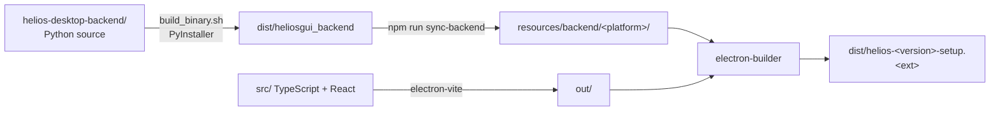

# Building installers

Packaging Helios means bundling **two** artifacts: the Electron app, and the PyInstaller-built
backend binary that ships inside it.

`npm run build` runs `scripts/sync-backend.js` **first**, then `electron-vite build`. The sync
script builds the backend binary if needed and copies it into `resources/backend/<platform>/`, from
where `extraResources` in `electron-builder.yml` places it at `<resourcesPath>/backend` in the
installed app — exactly where `backend-manager.ts` looks for it in packaged mode.

## Commands

| Target | Command |
|---|---|
| Current OS | `npm run package` |
| macOS | `npm run package:mac` |
| Windows | `npm run package:win` |
| Linux | `npm run package:linux` |
| All three | `npm run package:all` |
| Re-package without rebuilding | `npm run package:only` |
| Clean outputs | `npm run dist:clean` |

Output lands in `dist/`, named `${name}-${version}-setup.${ext}`.

## What each platform produces

=== "macOS"

    **`.pkg`** installer, installed to `/Applications`. Minimum system version **12.0**.

    Signing involves **two different certificates**:

    | Artifact | Certificate |
    |---|---|
    | The `.app` bundle | Developer ID **Application** |
    | The `.pkg` installer | Developer ID **Installer** (used by `productbuild`) |

    electron-builder finds the installer certificate in the keychain automatically, which is why
    `electron-builder.yml` has no `identity` key under `pkg`.

    The bundled backend binary needs signing too — `npm run sign:backend:mac`.

    Notarization runs from two hooks, because they fire at different times:

    - `afterSign` → the `.app` bundle, during app packaging
    - `afterAllArtifactBuild` → the `.pkg`, once targets are built

    Both no-op without `APPLE_ID` / `APPLE_PASSWORD` / `APPLE_TEAM_ID`, or with
    `SKIP_NOTARIZATION=1` — so local unsigned builds still work.

=== "Windows"

    **NSIS** assisted installer, x64. Not one-click: the user can choose the install directory.
    Per-machine, with elevation, desktop and start-menu shortcuts, and run-after-finish.

    `signAndEditExecutable: false`.

    A jump-list task "New Window" is registered at runtime, which re-launches the executable with
    `--new-window`; that hits the single-instance lock and the running instance opens a window
    instead. See [Process model & IPC](arch/processes.md).

=== "Linux"

    **AppImage** and **deb**.

    `maintainer` must carry an RFC-822 address (`Name <email>`), not a bare name — it becomes the
    deb's `Maintainer` control field. electron-builder only validates this when it is *unset*, so
    a bare name ships silently malformed. Only the deb target goes through fpm; AppImage never
    reads it.

    Additional installer payload and scripts live in `linux-installer/`.

## Configuration facts worth knowing

| Setting | Value | Note |
|---|---|---|
| `appId` | `com.navyug.helios` | Also set as the Windows AppUserModelId at runtime |
| `productName` | `Helios` | |
| `files` | `out/**`, `package.json` | Only build output ships |
| `npmRebuild` | `false` | The app ships **no runtime native modules** — this is why a Windows Job Object was rejected for process supervision |
| `afterPack` | `build/afterPack.js` | |
| `publish` | `generic` at a placeholder URL | Auto-update is **not** wired to a real endpoint yet |

Extra resources bundled alongside the app: the backend directory, `Helios_splash.png`, and the
512px icon.

## Prerequisites

Beyond the frontend toolchain, packaging needs everything the backend build needs: Python 3.11+,
CMake 3.20+ and a C++17 compiler for the PyHelios native library. The first native build takes
10–30 minutes; later ones are incremental.

On Windows, `scripts/setup-windows-dev.ps1` automates the toolchain check, the native build, the
PyInstaller bundle and the sync. Pass `-Force` to rebuild artifacts that already exist.

!!! warning "The migrations folder must be bundled"
    The PyInstaller spec must carry `--add-data app/db/migrations:app/db/migrations`. Without it
    the binary looks healthy and then fails at the first query with `no such table: projects`. The
    backend now detects this at startup and exits with code **14**. See
    [Database & migrations](arch/database.md).

## CI

Building installers in CI is covered in detail by [CI/CD workflow](../ci-cd-workflow.md). In
outline, the workflows are:

| Workflow | Trigger |
|---|---|
| `ci-develop.yml` | push / PR to `develop` |
| `ci-main.yml` | PR to `main` |
| `ci-release.yml` | push / PR to `release` |
| `build-installers.yml` | push, and manual dispatch |
| `publish-beta.yml`, `publish-stable.yml` | manual dispatch |
| `emergency-single-platform.yml` | manual dispatch |
| `backmerge-main.yml` | PR to `main` |

## Related

- [Backend sidecar](arch/backend.md) — how the packaged binary is found and launched.
- [Installing Helios](../user-guide/install.md) — what users do with these artifacts.
