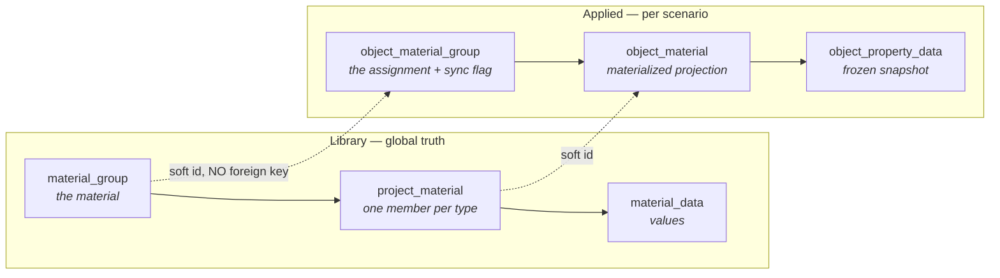

# Materials, assignment & sync

The material library, assigning materials to geometry, and the reconcile engine that keeps the two
in step — **deliberately, not automatically**.

6,388 lines of renderer; `material_library_service` (956), `material_sync_service` (478) and
`material_apply` (442) on the backend.

## The model in one diagram



!!! important "The break point"
    Library and applied state are linked **only by soft ids**. There is no foreign key, so a
    library edit **never cascades** into a scenario's applied state.

    Surviving orphan rows are not corruption — they **are** the out-of-sync state the sync API
    reports. That is the design.

A material *is* a group; there is no separate object above it. Groups are **global** — a material
is reusable across every project. See [Materials & textures](../../concepts/materials.md).

## Where the code lives

| Layer | File | Responsibility |
|---|---|---|
| Library UI | `containers/Materials/index.tsx`, `MaterialRow.tsx` | The saved-materials list |
| Form | `containers/Materials/MaterialPropertiesForm.tsx` | One card per material type |
| Bespoke editors | `MaterialVisualisationEditor.tsx`, `MaterialRadiationEditor.tsx` | Detected by property **signature**, not by name |
| Layout | `containers/Materials/materialBlueprint.ts` | Joins the catalog into render-ready groups |
| Routes | `app/routers/material_library.py` (15), `materials.py` (12) | |
| Library | `app/services/material_library_service.py` | CRUD, files, spectral labels |
| Reconcile | `app/services/material_sync_service.py` | The diff/apply engine |
| Engine | `app/services/material_apply.py` | Values → primitives |

## Assignment

`POST …/objects/{id}/material-groups` with `{ group_id, sync }` writes three things:

1. **`object_material_group`** — the user-facing assignment, carrying one `sync` flag.
2. **`object_material`** — one materialized row per member of that group.
3. **`object_property_data`** — a frozen snapshot of each member's values at assign time.

Those snapshot rows are the **single source of truth the viewport re-applies from**.
`reapply_all_materials` repaints from them, so hydration and in-place regeneration never re-read
the (possibly edited) library — including stale rows whose library member was deleted. They keep
painting until the scenario is synced.

Two invariants:

- **One member per material type per group** — `UNIQUE(material_group_id, material_type_id)`.
- **No duplicate material type across the groups on one geometry** —
  `UNIQUE(scenario_object_id, material_type_id)` is the database-level backstop, and
  `DUPLICATE_MATERIAL_TYPE_ASSIGNMENT` the friendly refusal.

## `sync = 1` or `sync = 0`

| | Behaviour |
|---|---|
| `sync = 1` | A reconcile refreshes the snapshot from the library |
| `sync = 0` | The snapshot is **frozen forever**. Library edits never reach it |

That is what the composite foreign key from `object_property_data` to `object_material` makes
possible — see [The property system](../arch/properties.md#where-values-live).

## The reconcile engine

Four issue kinds, computed per geometry by `_scenario_diff`:

| Issue | Meaning | Action |
|---|---|---|
| `group_deleted` | The assignment's group no longer exists | Drop the assignment and its member rows; snapshots cascade |
| `member_removed` | A materialized row's member is gone or moved | Drop the row |
| `member_added` | An assigned group has a member with no materialized row | Insert + snapshot |
| `values_stale` | A `sync=1` assignment whose snapshot differs from the library | Re-snapshot |

`member_added` is **skipped and reported** when another group's row already owns that material type
— the `UNIQUE(so, type)` constraint.

### Apply order is load-bearing

```
deletions → flush → additions → value refreshes
```

!!! danger "Why the flush is not optional"
    Remove-then-re-add of a material type produces a **new member id**. Without the flush, the
    addition would collide with the stale row the same pass is deleting — a spurious conflict on a
    perfectly valid change.

### Three entry points, one implementation

| Path | Trigger |
|---|---|
| **Eager** | A group `PUT`/`DELETE`/upload carrying `?scenario_id=` — the active scenario reconciles immediately |
| **Lazy** | `PUT …/material-sync` — reconcile on demand |
| **Status** | `GET …/material-sync` — a dry-run drift report |

All three go through the same diff. The assignment endpoints reuse the `materialize_member` and
removal primitives directly.

### Contracts the engine keeps

**Conflicts are skipped and reported, never raised.** Partial success is the normal outcome.

**`apply_sync` does not commit.** It mutates inside the caller's transaction and returns
`cleared_type_ids` per object; the caller commits, then repaints.

**No import of `scene_object_service`.** That would be a cycle. Repainting is the caller's job,
driven by the returned ids — `_apply_assignment_change`.

## Painting: how values reach the engine

Two channels, from `material_apply`:

| Channel | Mechanism |
|---|---|
| `color_r/g/b`, `opacity`, `texture_file` | A **per-object Helios material label**, `so_<id>` |
| Everything else | `ctx.setPrimitiveData<typed>(uuids, name, value)` — one label each, additive |

!!! note "Why colour goes through a material label"
    A material label is serialized by `writeXML`; a raw `setPrimitiveColor` is **not**. Using a
    label means colour survives a `context.xml` round-trip with no repaint on reload.

The texture *image* lives on that same label; the UVs were baked into the TileObject at build
time — `subdiv × texture_repeat`. Setting the texture to `""` clears it so the solid colour shows.

### Precedence: the Visualiser wins, or nobody does

The single-valued colour channel is owned by the precedence-winning assignment, which is the
**Visualiser** member.

With no Visualiser member there is **no winner** — the object falls back to the soil texture and
the default colour. Model-data labels are unaffected; they are additive, and each assigned material
contributes its own.

All PyHelios access here degrades to a no-op when the native library is unavailable (headless, CI)
or when the object was not built in this session.

## The form

Mostly **catalog-driven**: `materialBlueprint.ts` joins the catalog wire shape into render-ready
groups — top-level fields, then each collapsible group, with selector-gated groups appearing only
while their enum holds the matching value.

Two types have bespoke editors, detected by **property signature** rather than by name or id:

| Type | Detected by |
|---|---|
| Visualiser | the presence of `color_r` |
| Radiation | its own field signature |

So a new material type falls through to the generic renderer automatically. See
[Add a material type](../recipes/add-material-type.md).

**Visualiser modes are mutually exclusive.** `texture_toggle` picks one; that mode's fields are
required and the other mode's must be **absent** — `VISUALISER_MODE_CONFLICT` otherwise. A
Visualiser member is always exactly one complete mode, never empty and never both.

**`MATERIAL_WIDE_PROPERTIES`** are properties belonging to the material as a whole rather than the
type declaring them — `two_sided_heat_transfer` today. Several types carry it, every card shows
the same answer, and setting it on one sets it on all.

## Files

| | Texture | Spectral data |
|---|---|---|
| Endpoint | `POST …/groups/{id}/files/{property}` | `POST …/groups/{id}/spectral` |
| Creates the member if absent? | **Yes**, in texture mode | **No** — the card must already be saved |
| Returns | The stored file record | `{ success, path }` only |
| Persisted by | The upload itself | The member's own Save, from the staged path |

A spectral file holds many `<globaldata_vec2 label="…">` spectra and the upload returns only a
path, so `GET …/groups/{id}/spectral/labels` reads the labels back out of a stored file — without
it, reopening a material could not offer the spectrum pickers.

**Deletion is reference-counted.** `DELETE …/groups/{id}/files` returns **409 `FILE_IN_USE`** while
any material or frozen snapshot still references it, so callers fire it only after a save has
dropped the reference.

## Changing this feature

- **New material type?** [Add a material type](../recipes/add-material-type.md) — usually just a
  migration.
- **New property?** [Add a property](../recipes/add-property.md).
- **Touching the reconcile engine?** Keep the apply order, keep conflicts non-raising, and keep
  the no-commit contract.
- **Tempted to add a foreign key from applied state to the library?** That removes the break
  point, and the sync feature with it.

## Tests

`containers/Materials/tests/` on the renderer; `helios-desktop-backend/tests/` for the diff engine
— the four issue kinds and the apply ordering are the cases worth pinning.

## Related

- [Materials & textures](../../concepts/materials.md) — the schema.
- [Scene build & hydration](../arch/scene-build.md) — when a material change rebuilds geometry.
- [Geometry & scene objects](geometry.md) — assignment from the tree, and replace-vs-unassign.
