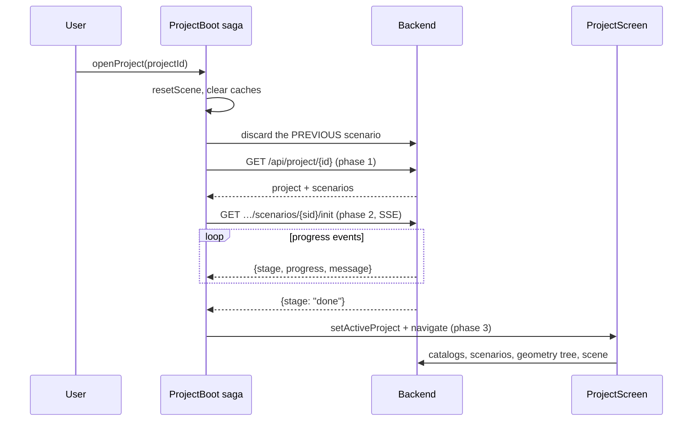

# Opening a project

The hardest flow in the app. A click on a project row has to load metadata, build a PyHelios
context, rebuild the saved scene into memory, and only then reveal a screen — while staying
cancellable throughout and surviving the user changing their mind twice.

Every phase is instrumented. Watch the console:

```
[boot] <projectId> — project 84ms | init 4120ms | reveal 2ms | total 4206ms
```

## The flow



Three phases, and **nothing else belongs in the loader**. Once the context is hydrated the screen
is safe to show; each panel fetches what it needs on mount.

## Where the code lives

| Layer | File | Responsibility |
|---|---|---|
| Saga | `containers/ProjectBoot/saga.ts` | The whole orchestration — run identity, phases, cancel, retry |
| State | `containers/ProjectBoot/reducer.ts` | `runId`, `progress`, `error`, `scopeLoss`, `liveScenario` |
| Progress | `containers/ProjectBoot/progress.ts` | Maps SSE events to a monotonic percentage |
| HTTP/SSE | `containers/ProjectBoot/service.ts` | `openInitChannel`, `discardScenario` |
| UI | `components/OpeningLoader/` | The loader and the scope-lost dialog |
| Route | `app/routers/scenario.py` | `init` (SSE) and `discard` |
| Service | `app/services/scenario_service.py` | `init_scenario`, `discard_scenario` |
| Hydration | `app/services/scene_object_service.py` | `ensure_hydrated` — see [Scene build & hydration](../arch/scene-build.md) |

## Phase 1 — Project metadata

`GET /api/project/{id}` returns the project plus its scenarios, and tells the boot **which
scenario to initialise**. So it must come before `init`.

It doubles as the reachability check: if the backend is still starting, this fails with a network
error and the dialog offers Retry. A separate health probe ahead of it would be one more request
for the same answer.

## Phase 2 — The init stream

The slow phase. It creates the scenario's PyHelios context and rebuilds the saved scene, streaming
progress as Server-Sent Events.

!!! important "Running init first and alone is the single biggest ordering fix in this flow"
    Hydration used to happen *by accident*, inside whichever call arrived first — usually the
    geometry tree — long after the screen had already switched.

### `init` is the one endpoint that takes `session_id` as a query parameter

Every other route uses the `session-id` **header**. `init` cannot: the browser's `EventSource` API
has no way to set request headers. `discard` keeps the header convention.

### The stream must be forked, not delegated

```ts
const task = yield fork(streamInit, runId, projectId, scenarioId)
yield join(task)
```

!!! danger "Why `yield*` was wrong"
    `utils/sse` emits `END` when the connection closes, and redux-saga **terminates** a saga
    blocked on `take(channel)` when `END` arrives — it does not resume it.

    Delegated with `yield*`, that termination killed the entire boot mid-flight: no success, no
    failure, the loader left on screen at whatever percent it had reached, and the Cancel listener
    gone with the run that owned it.

    Forked, `END` stops only that task, and `join` re-throws whatever it threw.

### A stream that ends without `done` is a failure

`take` returns `undefined` when the channel closes, and that is indistinguishable from a dropped
connection on the client. Reaching that point means neither `done` nor an error arrived.

That used to fall **through** to `reveal()` as if the boot had succeeded — on the theory that
hydration may well have finished anyway. It may have. But the screen was then handed a context
nobody confirmed, and when it had not, the failure surfaced later, one panel at a time, with no
way back to a retry.

It now throws with `status: 0`, which keeps it **retryable** — and a Retry finds a warm context in
seconds if hydration really did finish.

### There is no timeout

A large scene is legitimately slow. The wait continues until the stream ends on its own.

## Phase 3 — Reveal

```ts
localStorage.setItem(activeProjectId, projectId)
if (scenarioId) localStorage.setItem(activeScenarioId, scenarioId)
put(setActiveProject(projectId))
put(navigate('project'))
```

!!! note "The persisted ids record what FINISHED, never what was attempted"
    Both are written together or neither is, so a cancelled or failed open cannot leave half a
    pair behind for the next start to misread.

**The scenario id is deliberately not dispatched here.** `ProjectScreen`'s own `listScenarios`
sets it on mount; setting it early would start a scene load before the panels that feed it exist.

## The traps

### `runId` — stale runs must not write

Every run gets a number, it rides on every action the run dispatches, and the reducer drops
anything whose number is stale. A cancelled load still unwinding can never write over the load
that replaced it.

### `liveScenario` is not what is on screen

It is the scenario whose backend context is **hydrated and still held in memory**. It survives the
loader closing, and it is the record of what still needs releasing.

### Release before you load

```ts
put(resetScene()); clearSceneCache(); clearTextureCache()
yield* releaseLiveScenario({ exceptProjectId: projectId })
```

The previous scene is released **before** the new one loads, not after — otherwise both sit in
memory at once, and for a large scene that spike is enough to stutter or run out. Skipped when it
is the same scenario, since discarding only to re-hydrate from disk is pure cost.

### Cancel does not call the backend

!!! danger "Autosaving a half-hydrated context corrupts the saved scene"
    `/discard` autosaves first. Saving a half-hydrated context overwrites the scenario's real
    `context.xml` **and** rotates the good copy into the single archive slot.

    So `unwind()` leaves the backend alone. Work already in flight finishes and is reused if the
    user opens the same project again. The backend's `?save=false` path exists for exactly this,
    and is where a future cancel call belongs.

The backend independently stops hydrating when the `EventSource` drops — the route's `finally`
sets a `cancelled` event that `_hydrate` checks between objects.

### `discard` runs off the event loop

```python
return await asyncio.to_thread(scenario_service.discard_scenario, ...)
```

Called directly from an `async def` it froze the **entire backend** for the duration — every
request, not just this one. `init` suffered worst: its work runs in an executor thread and keeps
going, but the coroutine that *delivers* its progress events is on the loop. Nothing reached the
browser until the freeze ended, then the whole queue drained at once — the user saw no loading,
then an immediate "Scenario ready".

### A 404 must not stack two dialogs

A 404 means the project or scenario is gone, usually deleted in the other window.
`utils/scopeError` has already raised the blocking dialog, so the boot returns without adding a
second error message.

### Retryable is decided by status class

4xx means the ids are stale and a retry fails identically. 5xx and network errors are transient,
so the dialog offers Retry. `active` stays true on failure so the dialog can offer Retry **in
place** rather than dumping the user somewhere.

### The `finally` that must always fire

Any path leaving the worker without a terminal action strands the loader — progress on screen,
nothing happening, and no Cancel listener armed, because the race taking `CANCEL_BOOT` ended with
the run. The `finally` fails loudly instead, and the dialog always keeps Retry and Go to Home, so
a bug in here cannot trap the user.

### The restart path is different

Opening straight to `project` from `localStorage` mounts the screen in the first frame — before
the restore effect has even dispatched, because React runs child effects before parent ones. The
whole data load then goes out *ahead of* the `/init` it was meant to follow.

The `restored` flag on the navigation slice distinguishes that from a `navigate('project')`
dispatched by `reveal()`, and `ProjectScreen` uses it to hold its fetches back. See
[Add a screen](../recipes/add-screen.md).

## The backend side

`init` runs the work in an executor thread with **its own database session**:

```python
db_bg = SessionLocal()
```

`Depends(get_db)` closes the request's session the moment the generator returns — which, on a
client disconnect, happens while init is still querying.

**Nothing may escape that worker.** The stream ends only on an event from its queue, so a worker
dying silently would leave the client hanging on an open response forever. It catches
`BaseException` and pushes an error event. There is a second guard too: if the future is done and
the queue is empty, the stream emits `init ended without reporting a result` rather than polling
forever.

## Changing this flow

- **Adding a phase?** Put it in `runBoot`, add a stage to `progress.ts`, and lap the timings.
- **Tempted to load something in the loader?** Don't. The loader covers hydration; panels fetch on
  mount.
- **Touching cancel?** Re-read the corruption note above first.
- **Touching the stream?** Keep the fork.

## Tests

`containers/ProjectBoot/tests/` — the saga tests are the valuable ones, and they exist because
every side effect goes through `call`. Cover: a stale `runId` being ignored, a stream closing
without `done`, and cancel not calling the backend.

## Related

- [Scene build & hydration](../arch/scene-build.md) — what `init` actually does.
- [The Helios context](../../concepts/context.md) — what is being built.
- [State management](../arch/state.md) — sagas, SSE, scope loss.
