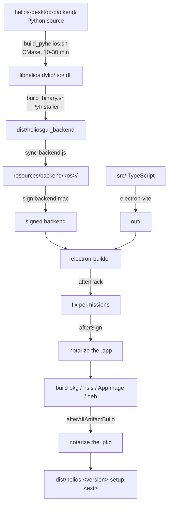

# Packaging & installers

The full path from Python source to a signed, notarized installer — and the signing traps that
only surface at the very end of a long build.

[Building installers](../build.md) is the command reference. This page is the mechanism.

## The pipeline

`npm run build` runs `sync-backend.js` **first**, then `electron-vite build`.

## Where the code lives

| Stage | File |
|---|---|
| Native build | `helios-desktop-backend/scripts/build_pyhelios.{sh,ps1}` |
| PyInstaller bundle | `helios-desktop-backend/scripts/build_binary.{sh,ps1}` |
| Sync into resources | `scripts/sync-backend.js` |
| macOS backend signing | `scripts/sign-backend-mac.js` |
| Packaging config | `electron-builder.yml` |
| Permission fix | `build/afterPack.js` |
| Notarization | `scripts/notarize.cjs`, `scripts/notarize-pkg.cjs` |
| Installer assets | `build/` — icons, entitlements, `installer.nsh`, `distribution.xml`, copy |
| Linux installer | `linux-installer/` |

## The backend must be signed separately — and by hand

!!! danger "The trap that costs a whole build cycle"
    Notarization rejects a bundle if **any** executable inside it is unsigned or lacks the
    hardened runtime.

    electron-builder signs the `.app` and the Electron framework. It does **not** sign
    `resources/backend/mac/` — that arrives via `extraResources` and is opaque to the signing
    machinery.

    Miss `npm run sign:backend:mac` and the build packages perfectly, then fails notarization with
    a vague *"The binary is not signed with a valid Developer ID certificate"* naming a path deep
    inside the bundle.

`sign-backend-mac.js` handles **both** PyInstaller layouts, because `sync-backend.js` supports both
and which ships depends on the backend's build script:

| Layout | Shape |
|---|---|
| `--onefile` | `resources/backend/mac/heliosgui_backend` — one file |
| `--onedir` | A directory: the executable plus dozens of `.so`/`.dylib`, **every one needing its own signature** |

Three rules it encodes:

**Sign innermost-first.** Signing a parent seals a hash of its children, so re-signing a child
afterwards invalidates the parent.

**Frameworks are signed as the `.framework` directory.** PyInstaller bundles `Python.framework`;
passing the inner binary fails with *"bundle format is ambiguous (could be app or framework)"*.

**Skip `.o` and `.a` intermediates.** They are Mach-O too — leftovers from the Helios C++ build —
but they are not runtime code.

## Two notarization hooks, because they fire at different times

| Hook | Notarizes | When |
|---|---|---|
| `afterSign` → `notarize.cjs` | The `.app` bundle | During app packaging |
| `afterAllArtifactBuild` → `notarize-pkg.cjs` | The `.pkg` installer | Once targets are built |

electron-builder fires `afterSign` **before any installer target exists**, so one hook cannot
cover both. The `.pkg` is built from the already-stapled app.

Both no-op without `APPLE_ID` / `APPLE_PASSWORD` / `APPLE_TEAM_ID`, or with
`SKIP_NOTARIZATION=1` — so local unsigned builds still work.

### Two different certificates

| Artifact | Certificate |
|---|---|
| The `.app` | Developer ID **Application** |
| The `.pkg` | Developer ID **Installer** (used by `productbuild`) |

electron-builder finds the installer certificate in the keychain automatically, which is why
`electron-builder.yml` has no `identity` key under `pkg`.

## `afterPack` — permissions survive, or the app does not start

`build/afterPack.js` restores the executable bit on the backend binary after macOS packaging.
File permissions can be lost during archiving, and a backend that is present but not executable
fails the manager's `[validation] checking execute access` step — the app then shows a Backend
Error dialog and quits.

## Per-platform notes

=== "macOS"

    `.pkg` into `/Applications`, minimum system version **12.0**.

    Order matters: build the backend → **sign the backend** → package → notarize the app →
    build the pkg → notarize the pkg.

=== "Windows"

    NSIS assisted installer, x64, per-machine with elevation.
    `signAndEditExecutable: false`.

    `build/installer.nsh` carries the NSIS customisation. A jump-list "New Window" task is
    registered at runtime and relaunches with `--new-window`, which the single-instance handler
    turns into a second window.

=== "Linux"

    AppImage and deb from electron-builder, plus a self-extracting `.run` built by
    `linux-installer/build-linux-run.sh` from `dist/linux-unpacked`.

    That script validates its inputs before doing anything — it checks for both the `helios`
    executable **and** `chrome-sandbox`, and fails with a clear message rather than producing a
    broken installer.

    `maintainer` must be an RFC-822 address (`Name <email>`); electron-builder only validates it
    when unset, so a bare name ships silently malformed into the deb's control file.

## What ends up where

| Path in the installed app | Source |
|---|---|
| `<resourcesPath>/backend/` | `resources/backend/${os}` |
| `<resourcesPath>/Helios_splash.png` | `resources/Helios_splash.png` |
| `<resourcesPath>/icon.png` | `build/icons/512x512.png` |
| The app itself | `out/**` plus `package.json` |

`<resourcesPath>/backend` is exactly where `backend-manager.ts` looks in packaged mode. See
[Backend sidecar](../arch/backend.md#startup-sequence).

## Two config facts that constrain the design

**`npmRebuild: false`** — the app ships **no runtime native modules**. This is why a Windows Job
Object was rejected for supervising the backend process: it would need an FFI native module. The
stdin pipe was chosen partly because it needs none.

**The PyInstaller bundle must carry the migrations folder** —
`--add-data app/db/migrations:app/db/migrations`. Without it the binary looks healthy and then
fails at the first query with `no such table: projects`. The backend now detects this at startup
and exits with code **14**.

## Publishing

`publish: generic` points at a placeholder URL. **Auto-update is not wired to a real endpoint.**

CI workflows are covered in [CI/CD workflow](../../ci-cd-workflow.md); `build-installers.yml`,
`publish-beta.yml`, `publish-stable.yml` and `emergency-single-platform.yml` are the packaging
ones.

## Changing this pipeline

- **Adding a bundled executable?** It needs signing on macOS — add it to `sign-backend-mac.js`.
- **Switching PyInstaller layout?** Both are supported; check the signing walk still finds
  everything.
- **Adding a native module?** `npmRebuild: false` will have to change, and the reasoning behind
  the stdin liveness pipe should be revisited.
- **Changing installer copy?** `build/*.txt` and `distribution.xml`.

## Related

- [Building installers](../build.md) — the commands.
- [Backend sidecar](../arch/backend.md) — what happens to the bundled binary at runtime.
- [Repo map](../repo-map.md) — `build/` vs `resources/` vs `out/` vs `dist/`.
