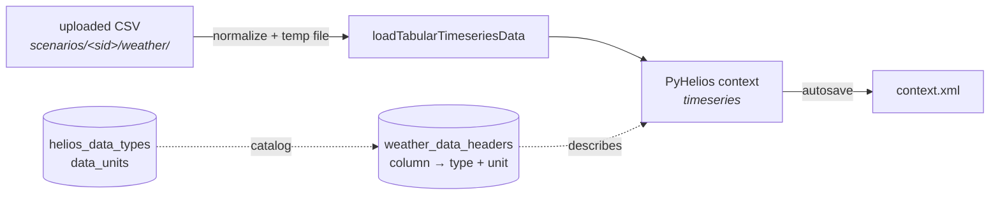

# Weather data

Importing, editing and unit-converting the time-series that drive a scenario.

24 renderer files, 3 backend services, **15 endpoints**, and 8 migrations' worth of seeded
catalog.

## Where the data actually lives

!!! important "Weather is not a table in SQLite"
    The values live in the scenario's **PyHelios context**, as timeseries. They reach disk only
    through `context.xml`, like the rest of the scene.

    SQLite stores the **headers** — the mapping from a CSV column name to a
    (data type, unit) pair — and nothing else about the data.



## Where the code lives

| Layer | File | Responsibility |
|---|---|---|
| Grid | `containers/Weather/WeatherTable.tsx`, `CellInput.tsx` | The editable table |
| Headers | `containers/Weather/HeaderEditor.tsx`, `DataTypeUnitPicker.tsx` | Column → type + unit |
| Import | `components/ImportWizard/`, `containers/Weather/parsers.ts` | File → rows |
| Units | `containers/Weather/unitConversion.ts` | Affine conversion, client-side |
| Validation | `containers/Weather/validation.ts` | Per-cell rules from the catalog |
| Effects | `containers/Weather/saga.ts` | All I/O |
| Routes | `app/routers/weather.py` | 15 endpoints |
| Data | `app/services/weather_service.py` | 1,606 lines — upload, cell ops |
| Headers | `app/services/weather_header_service.py` | Bulk and single-row header ops |
| Series | `app/services/timeseries_service.py` | |

## The catalog — a *separate* system

!!! warning "This is not the property catalog"
    Geometry and materials use `property_type` / `object_property_type` /
    `material_property_type`, which have **no units**. Weather uses `helios_data_types` and
    `data_units`, which do. The two are unrelated. See
    [The property system](../arch/properties.md#the-other-catalog-weather).

| Table | Holds |
|---|---|
| `helios_data_types` | A kind of measurement — Temperature, Humidity… Global, not session-scoped |
| `data_units` | A unit belonging to one type — Celsius → Temperature |
| `weather_data_headers` | Per scenario: this CSV column is *this* type in *this* unit |

Unit conversion is **affine**:

```
value_in_base = value × to_base_factor + to_base_offset
```

`is_base = 1` marks the canonical unit, and a partial unique index
(`idx_data_units_one_base`) enforces **at most one base per data type**.

### One invariant SQLite cannot express

For each header, the chosen `unit_id` must point at a `data_unit` whose `data_type_id` matches the
header's `helios_data_type_id`. That cannot be a `CHECK` constraint, so
`weather_header_service` **rejects mismatches at PUT time**. Any new path that writes a header must
do the same.

## Importing a file

`parsers.ts` is entirely pure — no I/O, no React, no Redux. File opening, reading and POSTing all
live in the saga. That is what makes the parsing directly unit-testable.

It handles **CSV, TXT, TSV, TAB and XML** — the extension list the file dialog is opened with is
`['csv', 'txt', 'tsv', 'tab', 'xml']` in `saga.ts`, pinned by a test so it cannot drift from the
parser. For the delimited formats it detects the delimiter and how many header lines to skip; XML
is read structurally, so neither control applies.

Date and time mapping is the fiddly part, because source files disagree wildly:

| Mode | Shapes supported |
|---|---|
| Date | separate parts, a single string, Julian day, or a combined datetime |
| Time | none at all, separate parts, a string, or a compact form |

!!! note "Strict on date, lenient on time"
    A date that cannot be parsed is an error. A missing or partial time is not — plenty of daily
    datasets have no time column at all.

On upload the backend normalizes in Python, streams through a **temp file**, and bulk-loads with
`loadTabularTimeseriesData`. The uploaded CSV is kept under
`scenarios/<sid>/weather/`.

## Editing cells

Surgical operations mutate the context directly:

| Operation | PyHelios call | Note |
|---|---|---|
| Add a cell | `addTimeseriesData(label, value, Date, Time)` | |
| Update a cell | `updateTimeseriesData(label, Date, Time, value)` | **The cell must already exist** |
| Clear everything | `clearTimeseriesData()` | |

Because these mutate `sctx.context` directly, every one of them is wrapped in
`@with_context_write_lock`.

!!! danger "Weather used to take no lock at all"
    That was survivable only while the autosave ran inline on the same thread — mutation and
    serialization could not overlap. Once the save moved to a queue they could: the queued
    `writeXML` holds `.read()` while it walks the context, and an unlocked weather mutation would
    rewrite it underneath.

    Measured with `.read()` held for 1.5 s: a geometry `PATCH` correctly waited 1.51 s, an
    unlocked weather `clear_data` went through in 0.01 s.

## Two traps worth knowing

### `deleteRow` is all-or-nothing, and opts out of scope detection

A single already-deleted row 404s the whole batch. Left to the default handling, that 404 would be
read as "the project or scenario is gone" and throw the user out of a perfectly healthy project.

So the call passes `{ skipScopeCheck: true }` — and therefore **must handle the error itself**,
because nothing else will surface it. See
[State management](../arch/state.md#scope-loss).

### Per-column update takes the column in the path

```
POST …/updateCol/{columnId}
```

The target column is identified by `columnId` **in the URL**, so it must not be repeated in the
request body.

## Units are converted client-side

`unitConversion.ts` converts a whole column when the user changes its unit, keeping both the new
and previous values so the change can be undone.

Formatting rounds to 12 decimal places, then truncates to the app's maximum decimals and strips
trailing zeros — the same 7-decimal rule the property system uses for canonical storage.

## The endpoints

| Group | Routes |
|---|---|
| Read | `inspect`, `getAllTimeSeriesData` |
| Bulk | `uploadfile`, `update`, `clear_data`, `delete` |
| Columns | `addCol`, `updateCol/{id}` |
| Rows | `addRow`, `deleteRow` |
| Headers | `GET`/`PUT`/`DELETE weather_data_header`, `PATCH`/`DELETE .../{header_id}` |

All are scenario-scoped with the **singular** `scenario` path segment — the scenario *lifecycle*
routes use the plural. They are not interchangeable.

## Changing this feature

- **Adding a data type or unit?** A migration seeding `helios_data_types` / `data_units`. Remember
  the one-base-per-type index.
- **Adding a header write path?** Enforce the unit/type invariant yourself.
- **Adding a cell mutation?** Wrap it in `@with_context_write_lock`.
- **Extending the import wizard?** Keep `parsers.ts` pure; put I/O in the saga.

## Tests

`containers/Weather/tests/` — the parsers and unit conversion are pure and heavily testable, which
is why they were split out. Note that Vitest pins `TZ=UTC`: weather formatting uses local-time
getters, so without the pin a developer in IST and CI in UTC render the same instant differently.
See [Testing](../testing.md).

## Related

- [The property system](../arch/properties.md) — the *other* catalog, and why they differ.
- [The Helios context](../../concepts/context.md) — what the weather lock protects.
- [Projects & storage](../../concepts/projects.md) — where uploaded CSVs live.
