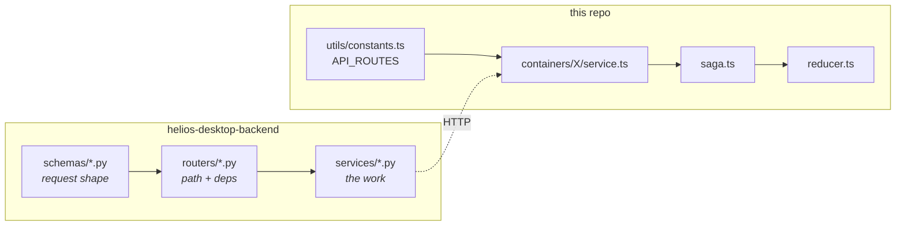

# Add an API endpoint

Add a route to the backend and call it from the renderer.

Seven files, two repositories. None of it is hard, but there are four decisions with
non-obvious right answers: **scope, lock, sync-or-async, and saga effect.**



---

## Step 1 — The request schema

`helios-desktop-backend/app/schemas/<feature>.py`

Plain Pydantic. Optional fields carry defaults; collections use `Field(default_factory=...)`.

```python
class SceneObjectUpdateRequest(BaseModel):
    properties: Optional[dict[str, Any]] = None
    visibility: Optional[dict[str, Any]] = None
    group_id: Optional[int] = None          # null = ungroup; check fields_set
    materials: list[GroupAssignmentIn] = Field(default_factory=list)
```

!!! tip "`None` and 'absent' are different — use `model_fields_set`"
    `group_id: None` means *ungroup*; omitting it means *don't touch the group*. A plain `is None`
    check cannot tell them apart. The update service does:

    ```python
    if "group_id" in body.model_fields_set:
        ...
    ```

    Any nullable field where clearing is a real action needs this.

Validation failures here come back as FastAPI's standard `detail: [{loc, msg}]` array, which the
renderer's `api.ts` maps to per-field errors automatically.

---

## Step 2 — The service function

`helios-desktop-backend/app/services/<feature>_service.py`

The router should contain almost nothing. All logic lives here, and there is a fixed opening
sequence for anything scenario-scoped:

```python
def update_thing(db: Session, session_id: str, project_id: str,
                 scenario_id: str, object_id: int, body) -> dict:
    _resolve_scope(db, session_id, project_id, scenario_id)   # 1. 404s
    sctx = _sctx(session_id, project_id, scenario_id)         # 2. live context
    ensure_hydrated(db, sctx, scenario_id)                    # 3. scene in memory
    so = _object_or_404(db, scenario_id, object_id)           # 4. the row
    ...
```

| Call | Does |
|---|---|
| `_resolve_scope` | `PROJECT_NOT_FOUND` / `SCENARIO_NOT_FOUND`. **Always first** — never trust ids from the path |
| `_sctx` | Gets or creates the scenario's PyHelios context, loading the snapshot on first use |
| `ensure_hydrated` | Rebuilds the saved scene into memory if it is not there yet |

Skip `_sctx` and `ensure_hydrated` for a purely relational endpoint that never touches geometry.

### Errors

Use the house shape. Never raise a bare `HTTPException` with a string.

```python
raise api_error(404, "GEOMETRY_NOT_FOUND", f"Geometry {object_id} not found")
```

The `code` is what the renderer branches on; the English message is free to be reworded. Pick a
code that already exists if the meaning matches — see
[The property system](../arch/properties.md#error-codes).

### Locking

The decision is **not** "does it write to the database" — it is **"does it mutate the PyHelios
context"**.

| Your endpoint | Lock | How |
|---|---|---|
| Mutates the context (create, edit, delete geometry; load weather) | `.write()` | `@_with_scenario_lock`, or `@with_context_write_lock` when the function takes ids rather than an `sctx` |
| Reads the context (pack primitives, `writeXML`) | `.read()` | `with sctx.lock.read():` |
| Touches only SQLite | none | — |

!!! warning "Serialising a read is a real cost, not a safe default"
    An exclusive lock made the autosave and the geometry read block each other though **neither
    mutates** the context. A save therefore held off the very fetch that draws the scene. Many
    readers or one mutator — take `.read()` when you are only reading, even if the operation is
    slow.

Both are **re-entrant for their holder**, so nested helpers are safe.

---

## Step 3 — The route

`helios-desktop-backend/app/routers/<feature>.py`

```python
_BASE = "/project/{project_id}/scenario/{scenario_id}"

@router.patch(_BASE + "/objects/{object_id}")
def update_object(
    project_id: str,
    scenario_id: str,
    object_id: int,
    body: SceneObjectUpdateRequest,
    session_id: str = Depends(get_session_id),
    db: Session = Depends(get_db),
):
    return svc.update_object(db, session_id, project_id, scenario_id, object_id, body)
```

- `Depends(get_session_id)` on **every** endpoint. It 400s on a missing `session-id` header.
- Scope goes in the **path**, not headers, for scenario-scoped routes.
- Reuse the module's `_BASE` constant.

!!! danger "`scenario` and `scenarios` are both real"
    Scenario lifecycle routes use the **plural** (`/api/project/{id}/scenarios/{sid}/init`);
    geometry and weather use the **singular** (`/project/{id}/scenario/{sid}/…`). Copy the
    neighbouring route rather than typing it.

### `def` or `async def`?

| Situation | Write |
|---|---|
| Ordinary DB work, quick engine calls | plain `def` — FastAPI runs it on a threadpool |
| Long blocking work (packing a whole scene) | `async def` + `await asyncio.to_thread(...)` |

```python
@router.get(_BASE + "/objects/{object_id}/geometry/binary")
async def get_object_geometry_binary(...):
    content = await asyncio.to_thread(svc.get_object_geometry_binary, db, ...)
    return Response(content=content, media_type="application/octet-stream")
```

Returning binary? Use `Response(..., media_type="application/octet-stream")`, not a JSON model.

### Cancellation, for long reads only

The whole-scene geometry route stops packing when the client goes away — 228 MB on a 1000×1000
ground, and the viewport asks more than once, so it used to keep building a buffer nobody would
receive.

!!! note "Use `request.receive()`, not `is_disconnected()`"
    Under this app's own `@app.middleware("http")`, `request.is_disconnected()` **never reports
    True** — `BaseHTTPMiddleware` leaves the message empty. The route watches a raw
    `request.receive()` instead, which is safe on a GET: with no body to read, the watcher cannot
    swallow the `http.request` message a body-reading route would need.

---

## Step 4 — Mount it (new routers only)

`helios-desktop-backend/app/main.py`

```python
app.include_router(soil.router, prefix="/api/soil", tags=["soil"])
```

Adding to an existing router needs nothing here.

!!! warning "Mounted is not the same as reachable"
    Seven routers are mounted today that the UI never calls. Mounting a router does not make a
    feature exist — steps 5 to 7 do.

---

## Step 5 — The route path, frontend side

`src/renderer/src/utils/constants.ts`

`API_ROUTES` is the **single source of truth** for every path the renderer calls. Scoped routes
are builder functions so a caller cannot forget an id:

```ts
geometry: {
  update: (projectId: string, scenarioId: string, objectId: string) =>
    `/api/geometry/project/${projectId}/scenario/${scenarioId}/objects/${objectId}`,
}
```

Never inline a URL string in a service or saga.

---

## Step 6 — The typed call

`src/renderer/src/containers/<Feature>/service.ts`

```ts
export interface UpdateObjectInput {
  properties: Record<string, number>
  visibility: { viewport: boolean; render: boolean }
  groupId: string | null
}

export function updateObject(
  projectId: string, scenarioId: string, id: string, input: UpdateObjectInput
): Promise<void> {
  return api
    .patch(API_ROUTES.geometry.update(projectId, scenarioId, id), {
      properties: input.properties,
      visibility: input.visibility,
      group_id: input.groupId == null ? null : Number(input.groupId)
    })
    .then(() => undefined)
}
```

Use `api` from `utils/api.ts` — never axios directly. It attaches the `session-id` header,
normalises errors into `ApiError`, and runs scope-loss detection.

The service layer is also where **wire ↔ UI shape** conversion belongs: the backend keys objects
by integer, the tree uses strings, so `service.ts` converts. Keep that out of sagas.

!!! note "Opt out of scope detection for a 404 that is not scope loss"
    `reportScopeFailure` reads a 404 with no machine `code` as "the project or scenario is gone"
    and raises a blocking dialog. For an endpoint that can 404 about something *inside* a healthy
    scenario, pass `{ skipScopeCheck: true }` — and then **handle the error yourself**, because
    nothing else will surface it. `POST /deleteRow` is the existing example.

---

## Step 7 — Actions, saga, reducer

`constants.ts` — the `_REQUESTED` / `_SUCCEEDED` / `_FAILED` triad:

```ts
export const UPDATE_OBJECT_REQUESTED = 'app/Geometry/UPDATE_OBJECT_REQUESTED' as const
export const UPDATE_OBJECT_SUCCEEDED = 'app/Geometry/UPDATE_OBJECT_SUCCEEDED' as const
export const UPDATE_OBJECT_FAILED    = 'app/Geometry/UPDATE_OBJECT_FAILED' as const
```

`saga.ts` — `call` every side effect so it stays testable:

```ts
export function* updateObjectWorker(action: UpdateObjectRequestedAction): Generator {
  try {
    yield call(service.updateObject, projectId, scenarioId, id, input)
    yield put(actions.updateObjectSucceeded(...))
  } catch (err) {
    yield put(actions.updateObjectFailed(..., (err as Error).message))
  }
}
```

### Choosing the effect

This one is worth getting right — the watcher at the bottom of `saga.ts` shows all three in use:

| Effect | Semantics | Use for |
|---|---|---|
| `takeLatest` | Cancel the in-flight one | Loads and lists — a stale response must not overwrite a newer one |
| `takeLeading` | Ignore new ones while busy | Writes — the double-tap guard on create/update |
| `takeEvery` | Run them all | Independent actions — per-row toggles, per-item deletes |

!!! tip "Guard writes three times"
    The create button is disabled while a write is in flight, the handler returns early anyway,
    and `takeLeading` is the last line of defence. All three are deliberate. Keep them.

Finally, wire the worker into the default export:

```ts
yield takeLeading(UPDATE_OBJECT_REQUESTED, updateObjectWorker)
```

---

## Verify

1. **Backend alone** — restart, then `/docs` shows the endpoint; try it from Swagger UI.
2. Missing `session-id` → **400**. Bad project id → **404 `PROJECT_NOT_FOUND`**.
3. **Frontend** — dispatch the action; the Network tab shows the call, Redux DevTools shows
   `_REQUESTED` → `_SUCCEEDED`.
4. Force a failure and confirm `_FAILED` lands and the UI recovers.
5. Add a saga test — sagas are testable precisely because every effect goes through `call`.

---

## Common mistakes

| Symptom | Cause |
|---|---|
| `400 session_id header is required` | `Depends(get_session_id)` missing |
| Works for any project id, including other users' | `_resolve_scope` not called first |
| Endpoint returns 200 with an empty scene | `ensure_hydrated` missing |
| The viewport freezes during a long save | Took `.write()` where `.read()` was correct |
| Deadlock or a very slow unrelated scenario | Held a lock across engine work, or locked the registry instead of the scenario |
| Whole app stalls while one request runs | Long blocking work in a plain `def` — use `async def` + `to_thread` |
| A stale response overwrites a newer one | `takeEvery`/`takeLeading` where `takeLatest` was right |
| Double-submit creates two objects | Missing `takeLeading` |
| A legitimate 404 throws the user back to Home | Needed `{ skipScopeCheck: true }` |
| Renderer branches on error text and breaks after a copy edit | Branch on `code`, never the message |
| Endpoint exists but nothing calls it | Steps 5–7 — see the seven dormant routers |

## Related

- [State management](../arch/state.md) — the renderer side in full.
- [The Helios context](../../concepts/context.md) — what the locks protect.
- [Backend API](../api/http.md) — conventions and the router map.
